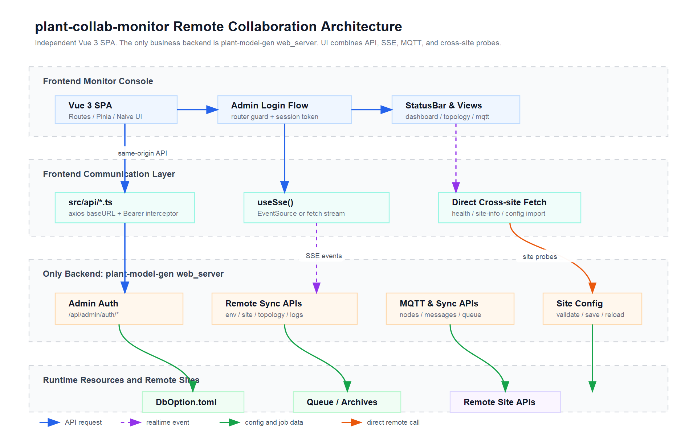

# plant-collab-monitor 异地协同管理功能分析

> 生成日期：2026-04-27  
> 范围：基于 `D:\work\plant-code\plant-collab-monitor` 当前前端代码与既有 PRD 复核。  
> 图文件：`docs/remote-collab-management-architecture.svg` / `docs/remote-collab-management-architecture.png`



## 1. 功能定位

`plant-collab-monitor` 是从 `web-server/frontend` 剥离出来的 Vue 3 专业监控台。它不自带后端，唯一业务后端是 `plant-model-gen` 的 `web_server`。异地协同管理功能的目标，是把多个物理站点抽象为可配置、可巡检、可同步、可观察的运行单元，并在一个 SPA 内完成：

- 站点身份与同步参数配置；
- 异地环境、站点的拓扑维护；
- MQTT 主从角色、Broker、订阅状态管理；
- 同步任务、历史、日志、增量归档观察；
- 后端断连、任务失败、实时事件的 UI 提醒。

## 2. 用户入口

路由集中定义在 `src/router/index.ts`，侧栏导航集中定义在 `src/App.vue`。

| 视图 | 路由 | 是否 admin | 主要职责 |
|---|---|---:|---|
| 全局概览 | `/dashboard` | 否 | 聚合同步状态、队列、MQTT、历史摘要 |
| 异地拓扑 | `/topology` | 是 | 管理 env/site，导入站点配置，健康检查与详情查看 |
| 拓扑可视化 | `/topology-viz` | 否 | 合并 remote topology 与 MQTT 状态，展示主从连接 |
| 任务队列 | `/tasks` | 否 | 展示同步任务等待、运行、失败情况 |
| 同步历史 | `/history` | 否 | 展示历史同步记录 |
| MQTT 消息 | `/mqtt/messages` | 否 | 展示 MQTT 投递消息 |
| MQTT 节点 | `/mqtt/nodes` | 是 | 管理主从节点、Broker、订阅、节点移除 |
| 系统日志 | `/logs` | 否 | SSE 实时日志 + 轮询兜底 |
| 归档管理 | `/archives` | 是 | 查看增量归档文件与站点配置摘要 |
| 站点配置 | `/site-config` | 是 | 编辑、校验、保存、热加载当前站点配置 |
| 参数设置 | `/settings` | 是 | 编辑同步运行参数 |

admin guard 的行为是：访问受保护路由时，如果 `adminAuth.isLoggedIn` 为 false，就把目标 path 写入 `sessionStorage`，弹出登录框，并跳回 `/dashboard`。登录成功后由 `LoginDialog` 消费 redirect key 回到原目标。

## 3. 核心数据流

### 3.1 管理请求流

所有同源管理 API 默认走 `src/api/http.ts` 的 axios 实例。`App.vue` 在启动时注册 token provider：

```text
adminAuth.token -> registerAuthTokenProvider -> axios request interceptor -> Authorization: Bearer <token>
```

401/403 或表示 admin 凭据问题的 503 会进入 `registerUnauthorizedHandler`，清 session 或弹出登录框。这条链路覆盖 `remoteSyncApi`、`mqttApi`、`syncApi`、`siteConfigApi`、`incrementalApi`、`deploymentSitesApi`。

### 3.2 实时事件流

`src/composables/useSse.ts` 提供双路径 SSE：

- 没有 token 时使用原生 `EventSource`；
- 有 token 时改用 `fetch + ReadableStream`，以便注入 `Authorization` header；
- 支持心跳超时、指数退避重连、`reconnectAttempt` 与 `nextRetryAt` 暴露给 UI。

当前主要接入点：

- `src/views/LogsView.vue`：订阅 `/api/sync/events/stream`，把事件 prepend 到日志列表，并调用 `appStatus.trackEvent()`；
- `src/views/MqttNodesView.vue`：订阅同一事件流，收到 `MqttSubscriptionStatusChanged` 后立即 `loadData()`；
- `src/stores/appStatus.ts`：维护 1 分钟事件数、后端连接状态、断连和失败任务通知。

### 3.3 跨站点直连流

`TopologyView.vue` 有少量有意保留的原生 `fetch`，因为这些请求不是打到本机后端，而是直接访问对端站点的绝对 URL：

- `GET {site.http_host}/api/health`：快速判断站点在线；
- `GET {site.http_host}/api/site/info`：查看远端站点详情；
- `GET {baseUrl}/api/site-config`：从远端站点导入配置。

这类请求绕过 axios `baseURL` 和 token interceptor，属于跨站点探测能力。

## 4. API 分层

| API 模块 | endpoint 前缀 | 用途 | 当前使用情况 |
|---|---|---|---|
| `remoteSyncApi` | `/api/remote-sync/*` | env/site CRUD、apply / activate / test-mqtt / test-http、runtime status/stop、tasks、env config、topology、logs、stats | `TopologyView`（含 2026-09-14 新增的部署动作）、`TopologyVisualizationView`、`LogsView` 已使用 |
| `mqttApi` | `/api/mqtt/*` | MQTT 节点、消息、订阅、主从角色、Broker 日志 | `MqttNodesView`、`MqttMessagesView`、`TopologyVisualizationView` 已使用 |
| `syncApi` | `/api/sync/*` | 同步状态、队列、配置、历史、runtime、MQTT Broker start/stop | `Dashboard`、`Tasks`、`Settings`、`MqttNodes`、`appStatus` 已使用 |
| `siteConfigApi` | `/api/site-config/*`、`/api/site/info` | 当前站点配置、校验、保存、reload、server-ip | `SiteConfigView`、`TopologyView`、`ArchivesView`、`SiteInfoBadge` 已使用 |
| `incrementalApi` | `/api/incremental/*` | 增量状态、历史、归档、detect/sync/abort | `ArchivesView` 使用归档入口 |
| `deploymentSitesApi` | `/api/deployment-sites` | 部署站点公开只读清单（`list / get`） | 2026-09-14 收敛：原封装的 import-dboption / CRUD / healthcheck / tasks / export-config 在后端不存在，已删除；当前无视图引用 |

## 5. 关键模块说明

### 拓扑管理

`src/views/TopologyView.vue` 维护 env/site 两层结构。新建 env 时会读取当前站点配置，自动填入 `file_server_host`、`mqtt_host`、`location_dbs` 等字段；创建成功后尝试把当前站点作为 site 自动加入新 env。站点列表会把当前站点置顶，并用 `http_host` 与 `window.location.origin` 比较避免删除主站点。

2026-09-14 起，该视图同时承担**部署动作面**：头部运行时状态 pill（`GET /api/remote-sync/runtime/status` 30s 轮询）与「停止运行时」；环境列表头部的「从 DbOption 导入」（`envs/import-from-dboption`）；环境卡片上的「测 MQTT / 测文件服务 / 应用 / 激活」（`envs/{id}/test-mqtt|test-http|apply|activate`），诊断结果以 inline banner 留在卡片内，当前激活的 env 挂「已激活」徽标；站点行的后端侧 `sites/{id}/test-http` 诊断与「编辑」（`PUT sites/{id}`）。`apply / activate` 会改写后端 `DbOption.toml`，都经 NDialog 二次确认。

### 拓扑可视化

`src/views/TopologyVisualizationView.vue` 同时读取 `mqttApi.nodes()`、`mqttApi.messages()`、`remoteSyncApi.topology()`。它先以 MQTT 节点状态为优先数据源，再用 remote topology 补齐配置中存在但 MQTT 暂未在线的节点；连接线从 env/site 配置生成，再用 MQTT 消息记录更新 active/received 状态。

### MQTT 节点管理

`src/views/MqttNodesView.vue` 同步读取订阅状态、节点和消息列表，支持：

- 主节点启动/停止 Broker；
- 任意节点启动/停止订阅；
- 主从角色切换；
- 查看 Broker 日志；
- 移除节点或取消订阅；
- SSE 收到订阅状态变更后秒级刷新，并保留 30s 轮询兜底。

### 全局状态条

`src/components/AppStatusBar.vue` 消费 `appStatus`。`appStatus.start()` 每 30s 聚合：

- `GET /api/site/info`：当前 location / role；
- `GET /api/sync/status`：runtime 状态；
- `GET /api/sync/queue`：任务队列；
- SSE 推入的事件计数：近 1 分钟 events/min。

连续失败达到阈值后会标记后端离线，并通过侧栏与浏览器通知提醒。

## 6. 当前实现注意点

- `deploymentSitesApi` 已收敛为后端实际存在的 `list / get`；“从 DbOption 导入”闭环走 `remoteSyncApi.importEnvFromDbOption()`（`POST /api/remote-sync/envs/import-from-dboption`），入口是 `/topology` 环境列表头部的「从 DbOption 导入」按钮（2026-09-14；NDialog 确认 → 刷新列表并选中新 env）。注意 plant-model-gen 每次导入都新建一个 env（不幂等），plant-web-server 按本站 id 覆盖同一个 env。
- 本机双站点 e2e smoke（`scripts/local-remote-collab-smoke.ps1`）最近一次结果为 1 passed / 12 failed（Site A/B/MQTT 未启动），部署动作面的端到端验证仍待补，见 `docs/plans/2026-09-14-remote-deploy-next-step-plan.md` P3。
- `MqttNodesView.vue` 的破坏性操作确认已收口到 Naive UI dialog，成功/失败反馈已收口到 message toast。
- 视图层已全部使用 `<script setup lang="ts">`；后续增强表单或 API payload 时，应继续把动态后端响应收口为局部 narrowing 或 API 层类型。
- 跨站点直连依赖浏览器 CORS 与对端站点版本；文档和 UI 已把 `/api/site/info`、`/api/site-config` 不存在或超时作为可见错误处理。

## 7. 代码入口索引

- 路由与 admin guard：`src/router/index.ts`
- 应用外壳、导航、token/unauthorized 注册：`src/App.vue`
- admin session：`src/stores/adminAuth.ts`
- 全局状态轮询与通知：`src/stores/appStatus.ts`
- axios 封装：`src/api/http.ts`
- SSE 双路径实现：`src/composables/useSse.ts`
- 异地拓扑管理：`src/views/TopologyView.vue`
- 拓扑可视化：`src/views/TopologyVisualizationView.vue`
- MQTT 节点管理：`src/views/MqttNodesView.vue`
- 系统日志实时流：`src/views/LogsView.vue`
- API 封装：`src/api/remoteSyncApi.ts`、`src/api/mqttApi.ts`、`src/api/syncApi.ts`、`src/api/siteConfigApi.ts`、`src/api/incrementalApi.ts`、`src/api/deploymentSitesApi.ts`
