# 协同配置向导 · 实操教程（真浏览器 + 真后端，照着 `/guide` 走完 8 步）

> 适用对象：第一次要把一个站点接入异地协同、想在监控台里边学边配的实施 / 运维人员。
> 预计用时：10–15 分钟。
> 生成方式：本文由 `scripts/collab-guide-live-tutorial.mjs` 于 2026-09-21 自动生成——Playwright 开真实 Chrome，照着监控台自带的「协同配置向导」（`/guide`）**从第 1 步走到第 8 步**，每一步先截向导页，再点「去页面操作」进 `/topology` 看高亮导览、在真实按钮上做动作，回来看判定是否变绿。后端是真后端（`http://127.0.0.1:4100`，plant-web-server 中继模式；对端 `http://127.0.0.1:4101`），截图里的每一条提示都是它当时的真实响应。
> 与另两份教程的分工：`topology-deploy-tutorial.md` 用 mock 喂页面、数据整齐可重复；`topology-deploy-live-tutorial.md` 直接在 `/topology` 上对真后端点按钮；**这一份走向导**——多了「为什么」「填什么（本站实时值）」「完成判定」三样，适合第一次上手。
> 收尾：本次新建的环境与站点跑完即删；激活改写过的 `DbOption.toml` 用开跑前记下的五个键写回原值并再激活一次确认无差；两站运行态恢复原状（核对见附录 B）。

## 你将学会

- 在向导里看清「本站身份」与登录态，再决定动不动手（第 1 步）。
- 分清环境 / 站点 / 运行时三个词，并在 `/topology` 上认出对应的三块区域（第 2 步）。
- 照着向导的「要填什么」表新建协同环境，用「帮我测」在动运行时之前确认 broker 与本站 CBA 目录可达（第 3、4 步）。
- 激活并核实 `runtime_config.changed` / `runtime/status`，把自动加进来的「本站」站点改成对端并再探测（第 5、6 步）。
- 核对运行态与台账、让对端也激活，最后停止运行时并把配置文件复原（第 7、8 步）。

## 0. 这一跑的现场

| 项 | 值 |
|---|---|
| 后端 | `http://127.0.0.1:4100`（plant-web-server，`identity.mode = detached`，site_id `local-a`） |
| 对端 Site B | `http://127.0.0.1:4101`（location `local-b`，自有库 `[（空）]`） |
| 本站 DbOption.toml 的五个连接键（开跑前） | broker `127.0.0.1:1883` · location `local-a` · 自有库 `[6000]` · CBA `http://127.0.0.1:4100/assets/archives` |
| 开跑前环境数 / 运行态 env / 账面当前环境 | 1 张 / 无 / 无 |
| 前端 | 生产构建（`vite preview`，自动登录默认关，第 1 步要真登录） |
| 生成时间 | 2026/9/21 20:45:57（本机时区） |

> 本机这套两站环境由 `scripts/local-remote-collab-setup.ps1` 生成在 `../plant-web-server/runtime/local-collab/`，起法见那里的 `COMMANDS.md`。**别把本教程的脚本指向生产后端**——它会真的建环境、真的改配置（两站都改）。

## 第 1 步 · 准备：后端在线、管理员已登录

侧栏「监控」组里点 **配置向导**（不设登录门），左边是 8 步清单，右边是当前步的「为什么 / 在页面上怎么做 / 要填什么 / 完成判定」。第 1 步先看「本站身份」卡——显示的 `site_id / location / 配置文件` 就是监控台此刻接着的那台后端；**不是你要配的那台，先改 `VITE_API_TARGET`**。生产构建默认不自动登录，所以这里要真的登一次（开发态 `npm run dev` 会用 `admin / admin` 静默登录，这一步直接绿）。

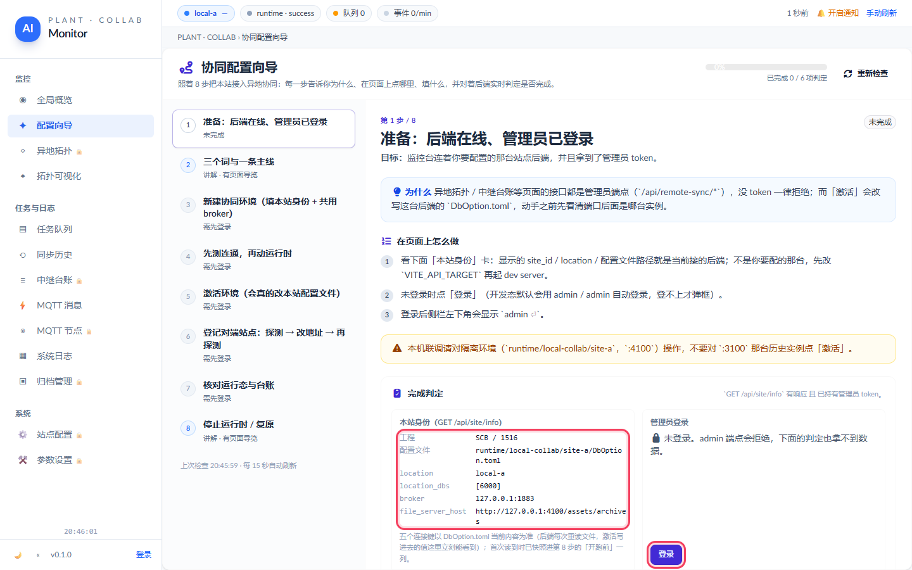

*打开 `/guide`：右侧「本站身份」卡已经拿到后端的 `site/info`，「管理员登录」卡显示未登录。*

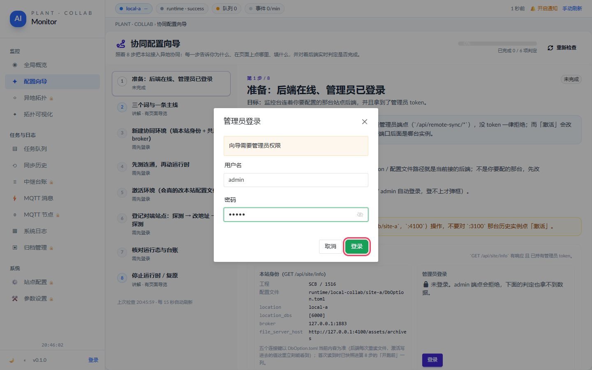

*账号密码就是后端进程的 `ADMIN_USER / ADMIN_PASS`（本机两站写死为 `admin / admin`）。*

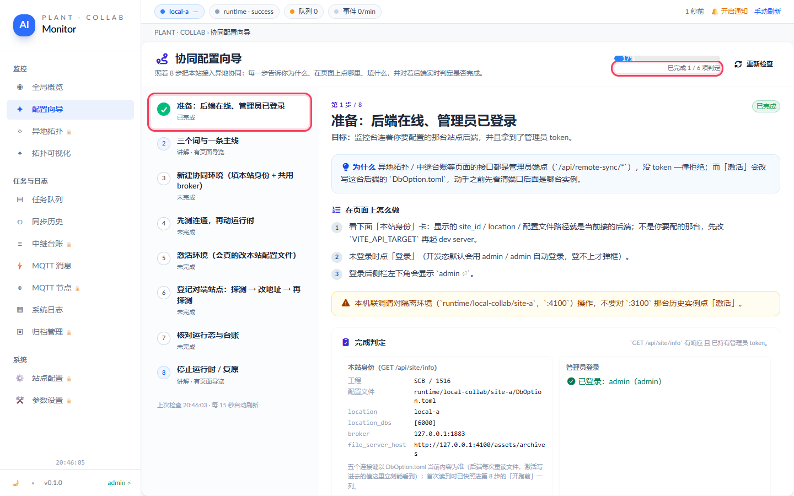

*登录成功：第 1 步「已完成」，右上角进度「已完成 1 / 6 项判定」；此时向导已把本站五个连接键快照进 sessionStorage，第 8 步复原时用。*

登录后向导自动重查：第 1 步 `done`，第 3 步 `todo`（列表里还没有带 broker 的环境卡），第 5 步 `todo`。它默认会停在**第一个没完成的步骤**。

## 第 2 步 · 三个词与一条主线

概念页，不做判定。三个词：**环境（Env）= 本站怎么接入协同**（共用 broker + 本站身份，激活写进 `DbOption.toml` 的就是这五个键）、**站点（Site）= 环境下登记的对端节点**、**运行时（Runtime）= 本站中继此刻按哪个环境在跑**。点「去页面看导览」到 `/topology` 上认一遍三块区域。

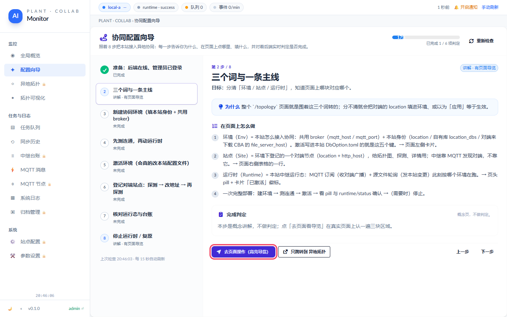

*看完概念点「去页面操作（高亮导览）」。*

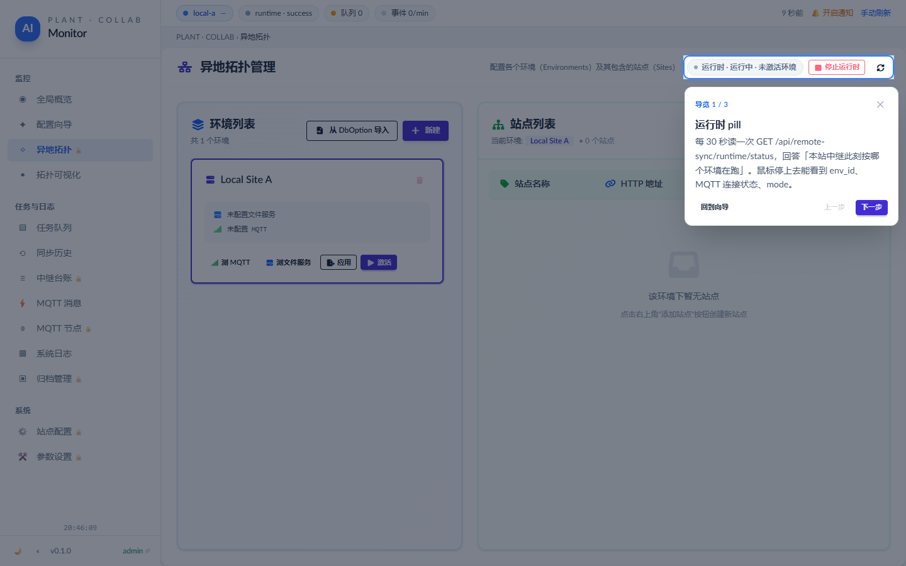

*导览 1/3：运行时 pill——每 30 秒读一次 `runtime/status`，回答「本站中继此刻按哪个环境在跑」。*

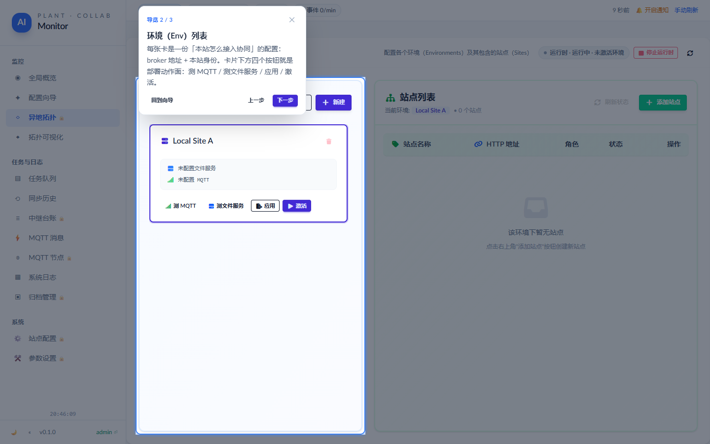

*导览 2/3：环境（Env）列表，每张卡是一份「本站怎么接入协同」的配置，卡片下方四个按钮就是部署动作面。*

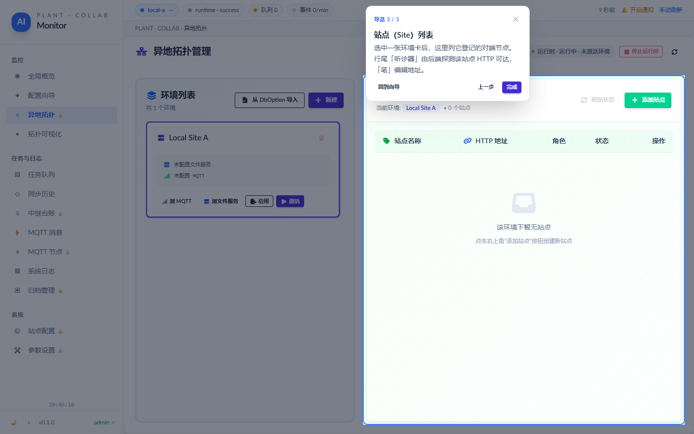

*导览 3/3：站点（Site）列表，选中环境卡后列它登记的对端节点；点「完成」结束。*

## 第 3 步 · 新建协同环境（填本站身份 + 共用 broker）

目标：左侧多一张**带 broker 地址**的环境卡。「从 DbOption 导入」生成的本站登记卡不带连接参数，对它激活 = 按文件现状原样起中继、一个键都不改，所以真要跑中继得手填新建。向导的「要填什么」表把本站 `site/info` 的实时值列出来了，点一下就能复制——填的是**本站怎么接入协同**，不是对端长什么样。

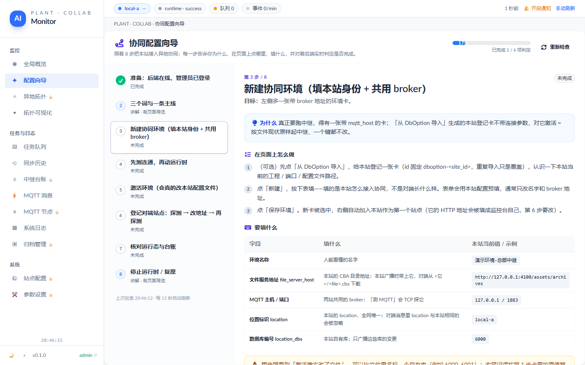

*「要填什么」表格里的「本站当前值」直接来自 `GET /api/site/info`，点击即复制。*

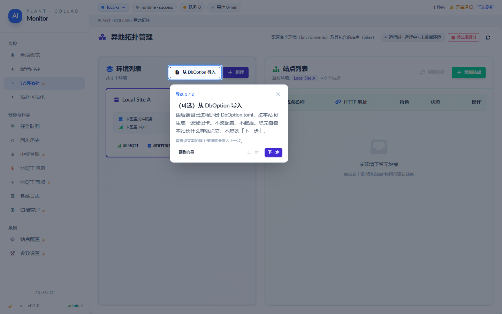

*导览 1/2：（可选）「从 DbOption 导入」给本站登记一张卡，不改配置、不激活；这里直接「下一步」。*

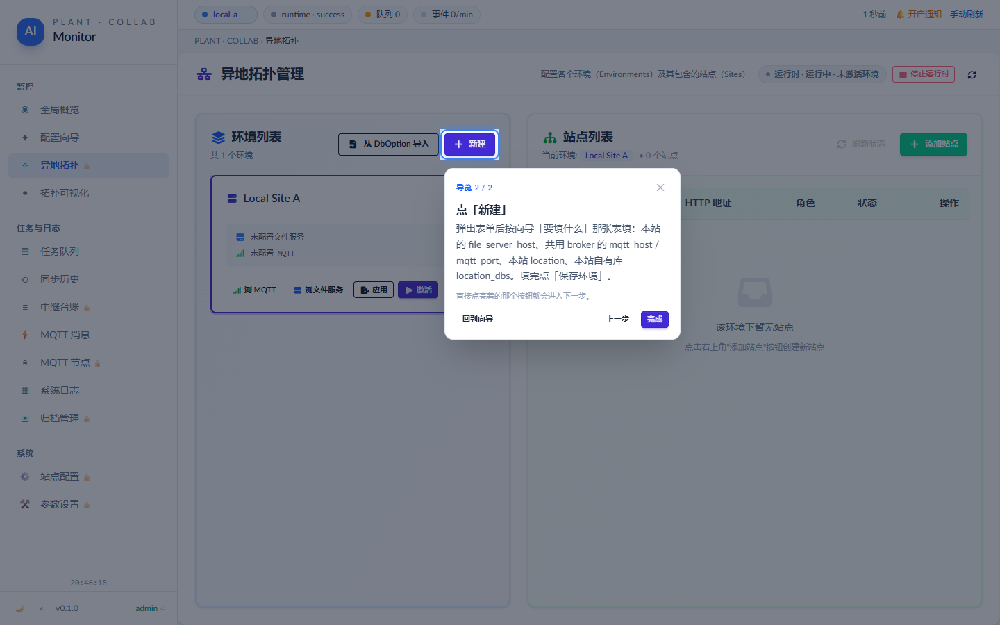

*导览 2/2：点亮着的「新建」——直接点它就打开表单，导览随之结束。*

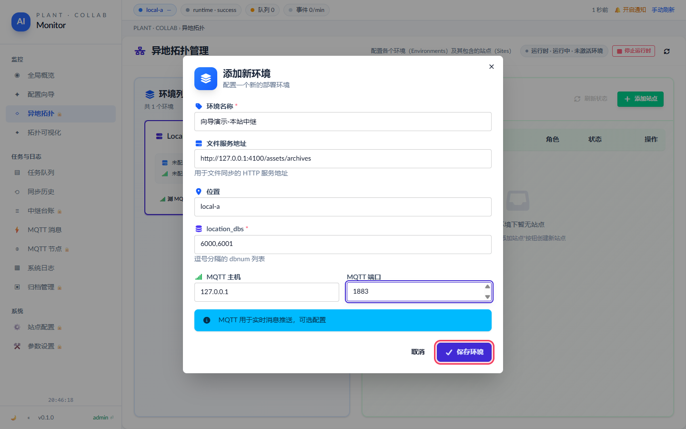

*表单默认用本站配置预填（这一跑预填的 file_server_host 是 `http://127.0.0.1:4100/assets/archives`），按向导表格核对 / 改动后点「保存环境」。*

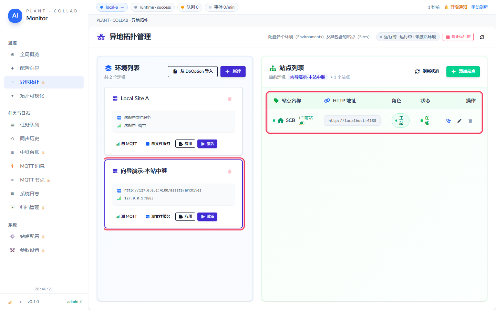

*保存后新卡被选中，右侧自动加入了 1 个站点（本站，HTTP 地址被填成监控台自己——第 6 步要改）。*

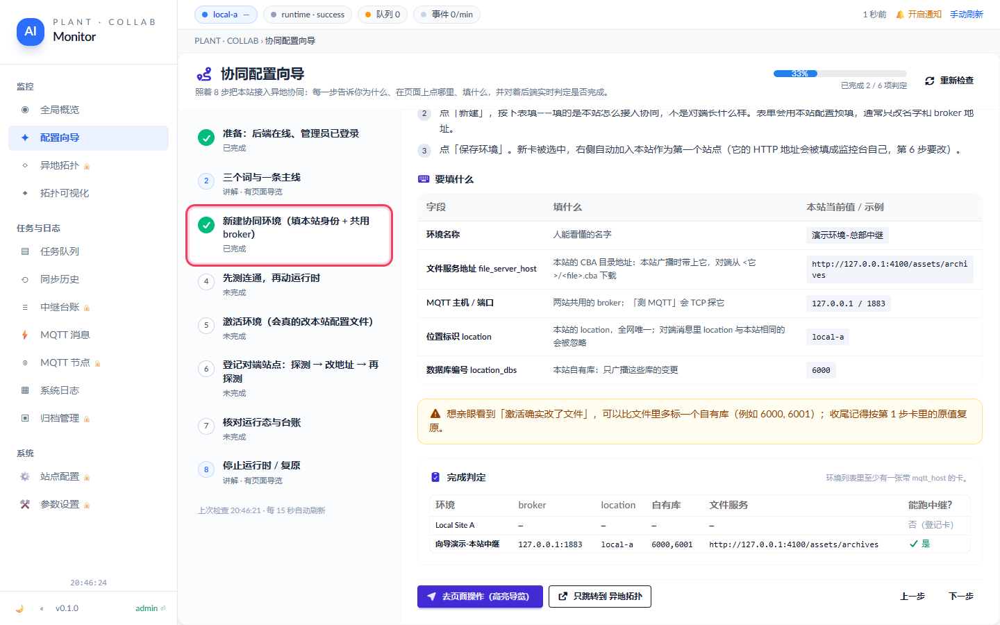

*回到向导，第 3 步 `done`，进度「已完成 2 / 6 项判定」；环境表按 `envs` 实时列出每张卡能不能跑中继（有 `mqtt_host` 才算）。*

| 字段 | 填什么 | 这一跑填的 |
|---|---|---|
| 环境名称 | 人能看懂的名字 | `向导演示-本站中继` |
| 文件服务地址 file_server_host | 本站的 CBA 目录地址：本站广播时带上它，对端从 `<它>/<file>.cba` 下载 | `http://127.0.0.1:4100/assets/archives` |
| MQTT 主机 / 端口 | 两站共用的 broker | `127.0.0.1` / `1883` |
| 位置标识 location | 本站的 location，全网唯一 | `local-a` |
| 数据库编号 location_dbs | 本站自有库：只广播这些库的变更 | `6000, 6001`（比文件里多标了 `6001`，向导第 3 步的「注意」就是这么建议的——第 5 步好看出激活确实改了文件） |

## 第 4 步 · 先测连通，再动运行时

探测由后端发起，探的是「后端到目标」的网络：**测 MQTT** 让后端 TCP 连 `mqtt_host:mqtt_port`，**测文件服务** 让后端对 `file_server_host` 发一次 GET。向导页自带「帮我测」，在 `/topology` 卡片上点也一样算——两处的结果记在同一份 sessionStorage 里（按环境），刷新不丢。红条会透出后端原话（connection refused / HTTP 404 / 目标 URL / 耗时）。

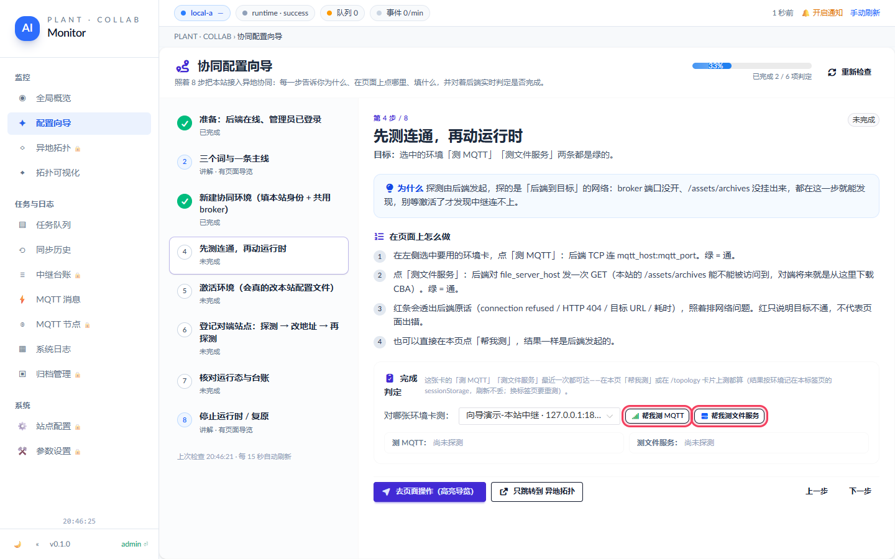

*选中刚建的环境，点「帮我测 MQTT」「帮我测文件服务」。*

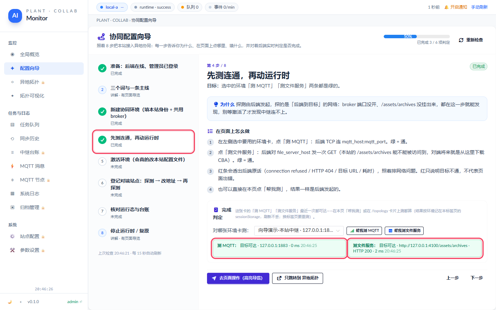

*这一跑的真实结果：「测 MQTT：目标可达 · 127.0.0.1:1883 · 0 ms 20:46:25」「测文件服务：目标可达 · http://127.0.0.1:4100/assets/archives · HTTP 200 · 2 ms 20:46:25」→ 第 4 步 `done`，进度「已完成 3 / 6 项判定」。*

> 红只说明目标不通，不代表页面出错：broker 端口没开、`/assets/archives` 没挂出来、地址写成了对端，都在这一步就能发现，别等激活了才发现中继连不上。

## 第 5 步 · 激活环境（会真的改本站配置文件）

**激活** = 让本站从此按这个环境跑中继。plant-web-server 先把五个连接键写进本站 `DbOption.toml`（环境上没有的键不动），再起 / 重建中继运行态，不用重启进程；写不进文件或中继起不来整条失败，不会留下「账面已激活、跑的还是旧配置」的中间态。这是整页最重的动作——点之前确认端口后面是哪台实例。

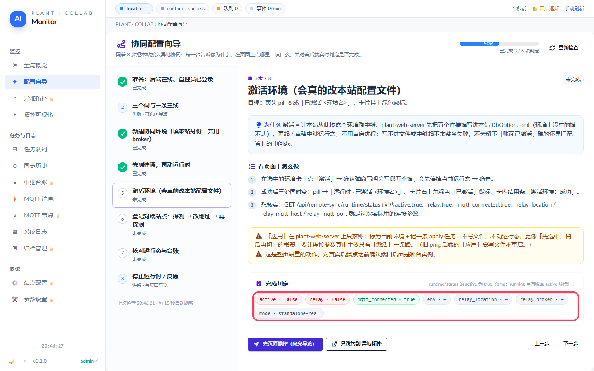

*激活前运行态 chips：`active · false`。点「去页面操作」。*

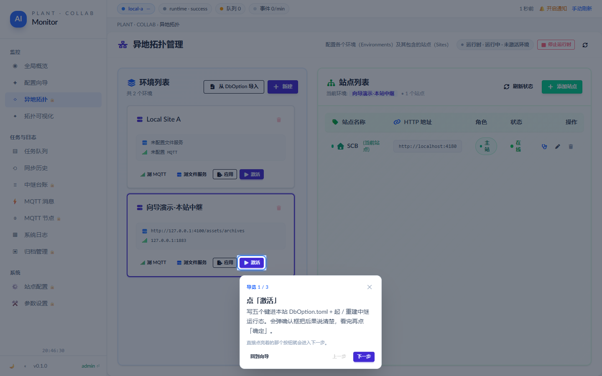

*导览 1/3：点亮着的「激活」——会先弹确认框把后果说清楚。*

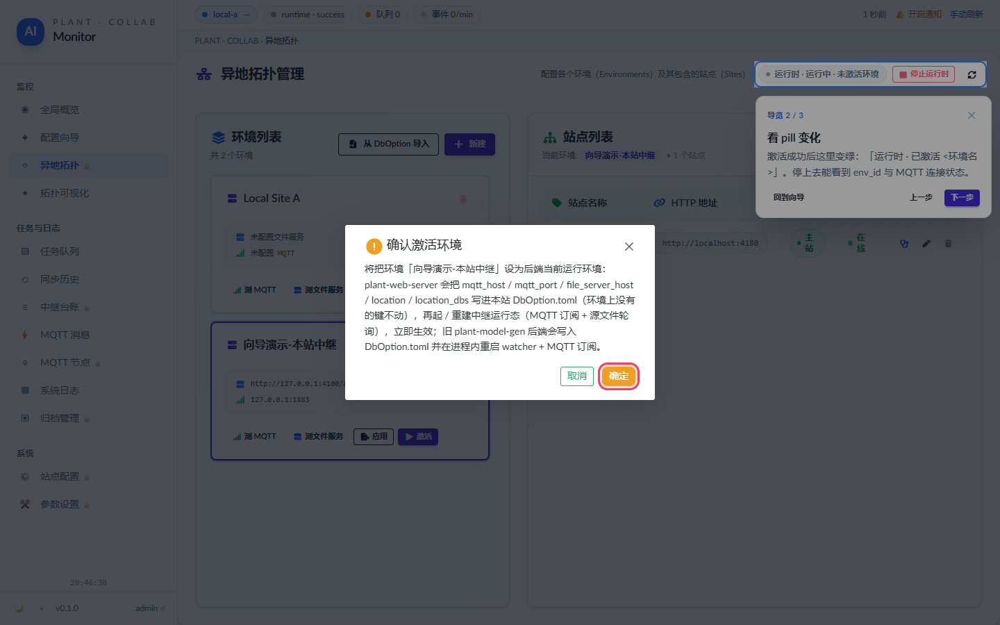

*确认弹窗（在导览之上可操作）：看完再点「确定」。*

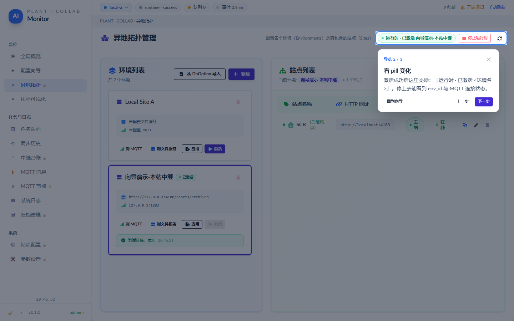

*导览 2/3：pill 变绿；卡片右上角「已激活」徽标、卡内「激活环境：成功」三处同时变。*

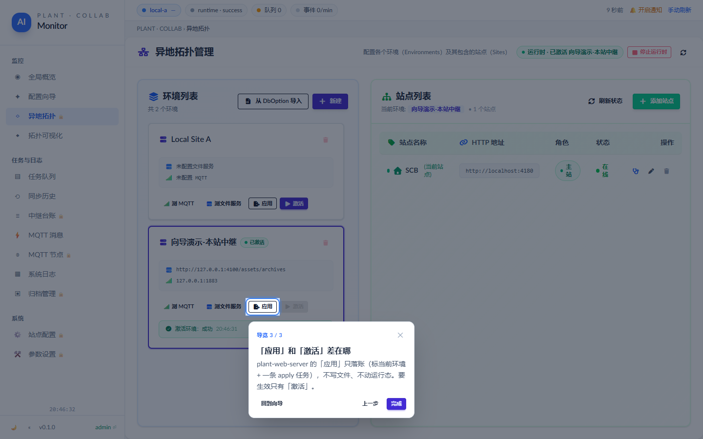

*导览 3/3：plant-web-server 的「应用」只落账（标当前环境 + 一条 apply 任务），不写文件、不动运行态；要生效只有「激活」。*

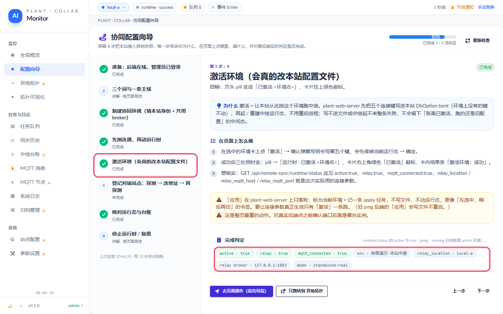

*回到向导：第 5 步 `done`，第 7 步也随之 `done`，进度「已完成 5 / 6 项判定」。*

激活的真实响应：`relay: true`，`runtime_config: {"changed":true,"keys":["mqtt_host","mqtt_port","file_server_host","location","location_dbs"],"path":"runtime/local-collab/site-a/DbOption.toml"}`——**`changed: true` 就是「文件真被改了」的凭证**，`keys` 是写进去的五个键。直接打开 `../plant-web-server/runtime/local-collab/site-a/DbOption.toml` 看：`location_dbs = [6000, 6001]`（开跑前 `[6000]`），多出来的 `6001` 就是第 3 步多标的那一个。

**但激活后 `GET /api/site/info` 读回的自有库仍是 `[6000]`**——这台 plant-web-server（进程 `local-a`）的 `site/info` 回的是启动时读进内存的那份配置，激活写了文件它不知道；所以判断「文件被改了没」要看 `runtime_config.changed`，向导第 8 步「文件现状」那一列在这种后端上也会跟不上（plant-web-server 2026-09-21 起改为每次重读，换新版本即可）。 `runtime/status`：`active: true`、`relay: true`、`mqtt_connected: true`、`relay_location: local-a`。

## 第 6 步 · 登记对端站点：探测 → 改地址 → 再探测

右表登记的是对端节点（`location` + `http_host`），给拓扑图、探测和「查看站点详情」用；中继靠 MQTT 发现对端，不靠它。保存环境时自动加进来的那个站点指向的是**你自己**（监控台地址），生产 / `vite preview` 下探测必然 `404`（开发态 `npm run dev` 会误报 200——vite 把 `/metadata.json` 当页面路由回了 index.html）。真要登记对端必须手动改成对端地址：对端 plant-web-server 的 `/files/output`，它下面有 `metadata.json`。

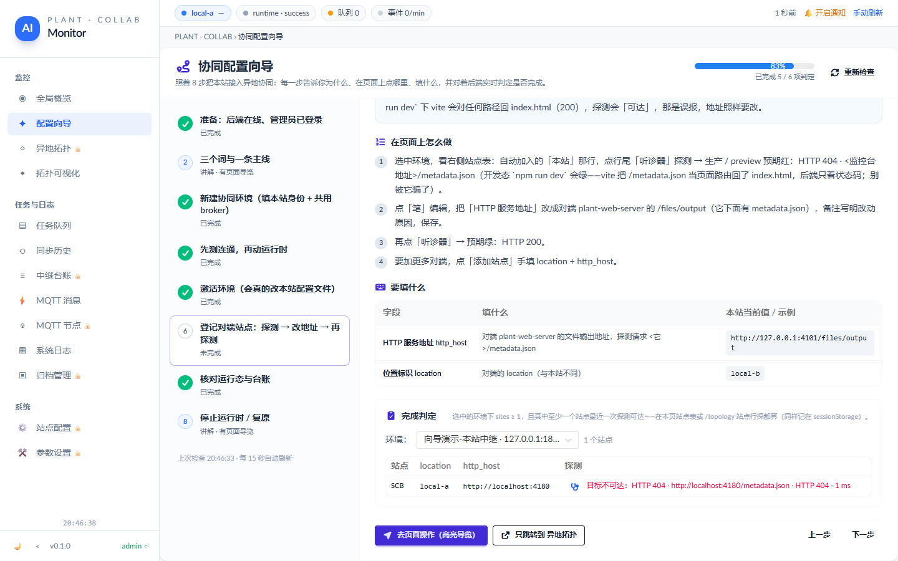

*向导页站点表直接探：「目标不可达：HTTP 404 · http://localhost:4180/metadata.json · HTTP 404 · 1 ms」——指向监控台自己，所以不通。点「去页面操作」去改地址。*

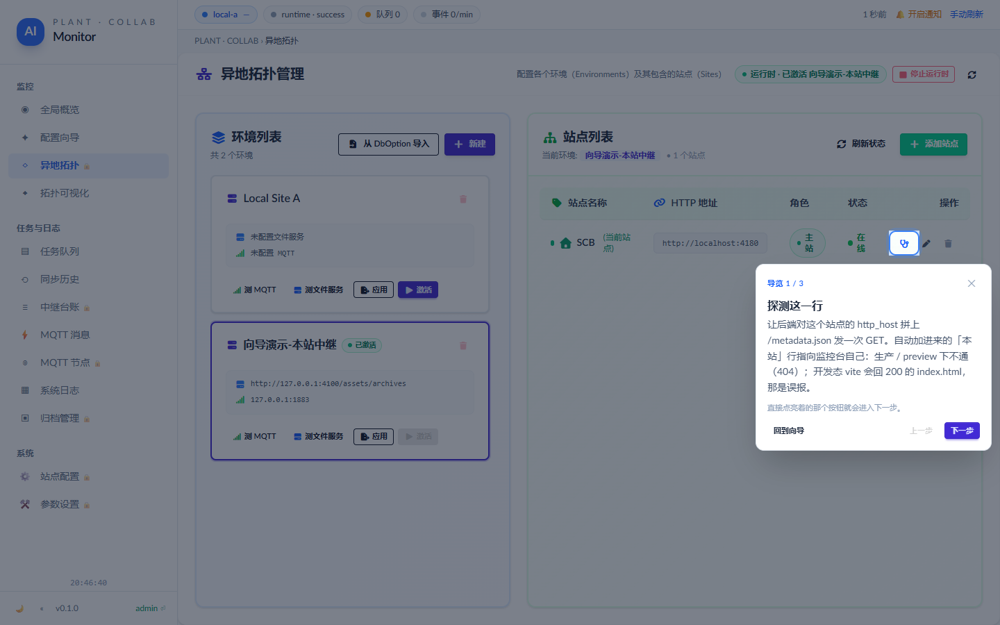

*导览 1/3：点亮着的「探测」——让后端对这个站点的 `http_host` 拼上 `/metadata.json` 发一次 GET。*

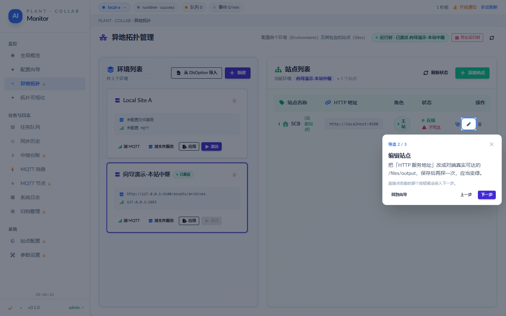

*第一次探测：后端探测：目标不可达：HTTP 404 · http://localhost:4180/metadata.json · HTTP 404 · 1 ms。导览 2/3：点亮着的「编辑」改地址。*

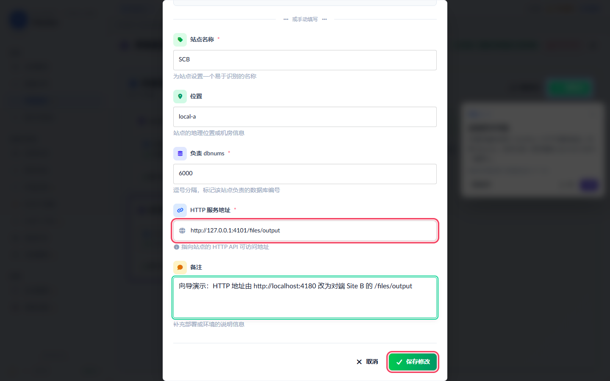

*把「HTTP 服务地址」改成对端真实可达的 `/files/output`，备注写明原因，点「保存修改」。*

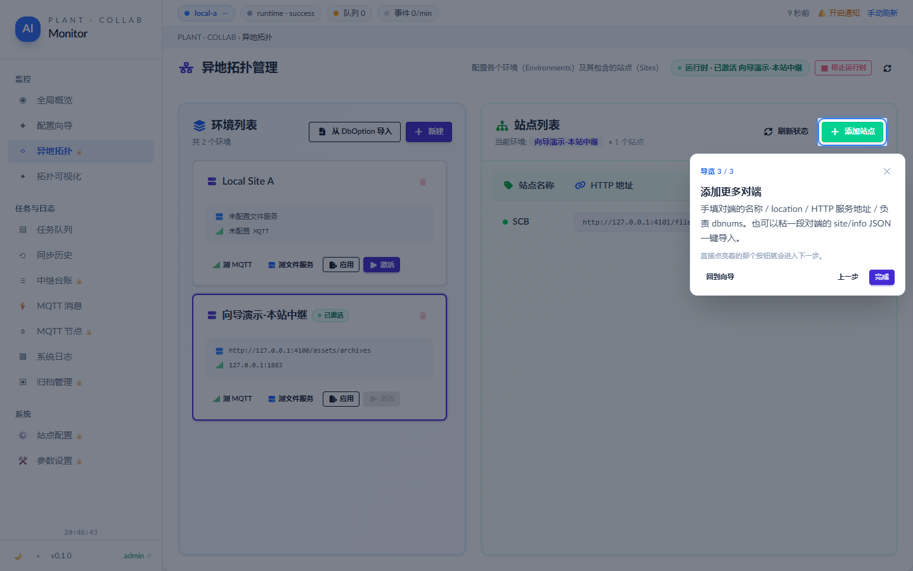

*导览 3/3：要加更多对端点「添加站点」；这里点「完成」结束导览。*

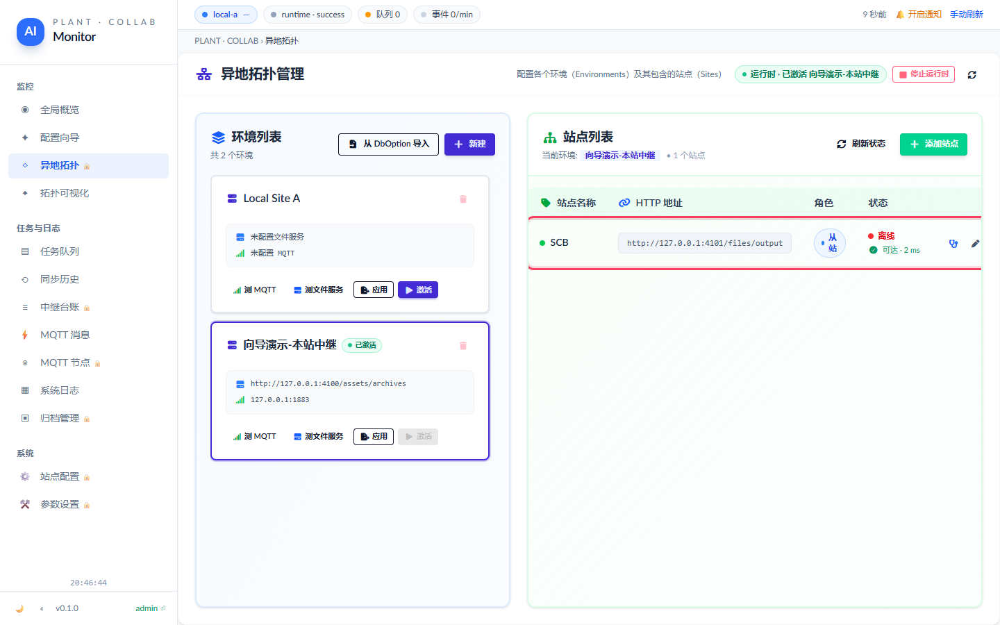

*第二次探测：后端探测：目标可达 · http://127.0.0.1:4101/files/output/metadata.json · HTTP 200 · 2 ms。*

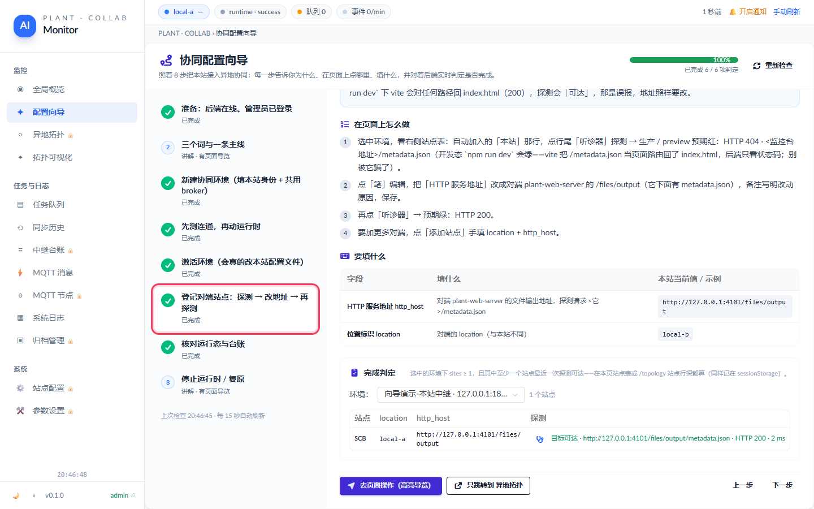

*回到向导：在 /topology 上探的那次可达已被记住，第 6 步 `done`，进度「已完成 6 / 6 项判定」。*

自动加入的本站行原来的地址是 `http://localhost:4180`（监控台自己）：改之前 `后端探测：目标不可达：HTTP 404 · http://localhost:4180/metadata.json · HTTP 404 · 1 ms`；改成对端 `http://127.0.0.1:4101/files/output` 之后 `后端探测：目标可达 · http://127.0.0.1:4101/files/output/metadata.json · HTTP 200 · 2 ms`。保存后回查后端 `GET envs/{id}/sites`，`http_host` 与 `notes` **都已更新**。

## 第 7 步 · 核对运行态与台账（对端也要激活自己的环境）

页面上的成功提示不等于后端真在跑：`runtime/status` 的 `active / relay / mqtt_connected` 才是中继活着的证据；每一次广播 / 接收都记在 SQLite 台账里，`/ledger` 能点开看 RefNo 级变更清单。**对端也要激活自己的环境**（同一 broker、不同 location），两边才互相收得到——这一跑让对端 Site B 按它自己的 `site/info` 建卡并激活（走它自己的 API，监控台只接着 Site A）。

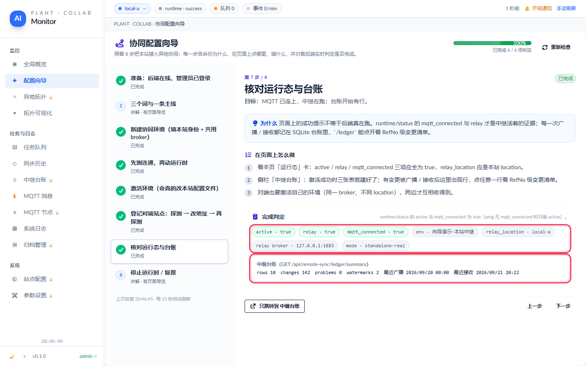

*运行态 chips：「active · true relay · true mqtt_connected · true env · 向导演示-本站中继 relay_location · local-a relay broker · 127.0.0.1:1883 mode · standalone-real」；台账：「中继台账（GET /api/remote-sync/ledger/summary） rows 10 changes 142 problems 0 watermarks 2 最近广播 2026/09/20 00:00 最近接收 2026/09/21 20:22」。*

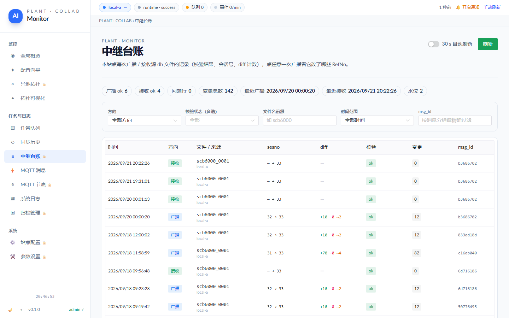

*「中继台账」：激活成功时三张表就建好了；有变更被广播 / 接收后这里出现行，点任意一行看 RefNo 级变更清单。*

本站 `runtime/status`：`active: true`、`relay: true`、`mqtt_connected: true`、`relay_location: local-a`。台账 `ledger/summary`：rows 10 · changes 142 · problems 0。

对端 Site B（`http://127.0.0.1:4101`）按自己的身份（location `local-b`、broker `127.0.0.1:1883`、自有库 `[（空）]`）建卡激活：HTTP 200，`relay: true`，`runtime_config.changed: false`（它的文件本来就是这几个值，所以一个字节没改）；它的 `runtime/status`：`active: true`、`relay_location: local-b`。两站同一 broker、不同 location，至此互相收得到。

## 第 8 步 · 停止运行时 / 复原

「停止运行时」停的是运行态不是配置：MQTT 订阅与源文件轮询都停、pill 回到「运行中 · 未激活环境」，但 `DbOption.toml` 里刚写进去的五个键**不回滚**、账面「当前环境」标记也留着，再点一次「激活」就按同一份配置跑起来。要把文件写回原值：按第 1 步记下的五个键新建一张「恢复卡」并激活；再激活一次，响应 `runtime_config.changed` 应为 `false`。向导第 8 步把开跑前的五个键列在那里，就是给这一步用的。

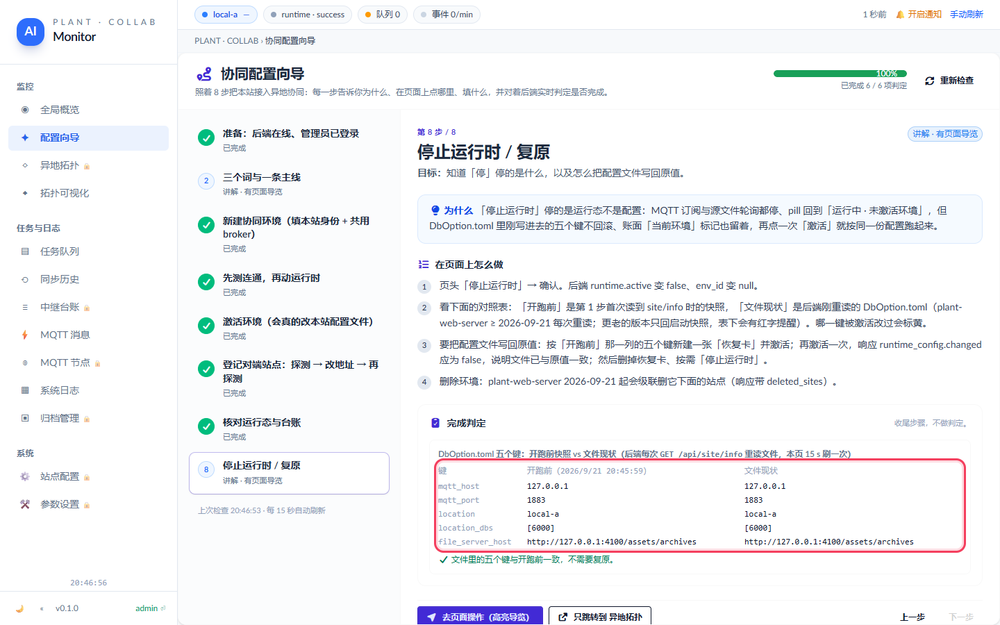

*向导对照后显示「文件里的五个键与开跑前一致，不需要复原。」——**但文件其实已被第 5 步改过**（直接读文件：`location_dbs = [6000, 6001]`）：这台后端的 `site/info` 只回启动快照，「文件现状」一列跟不上；以第 5 步的 `runtime_config.changed: true` 为准，照样要复原。*

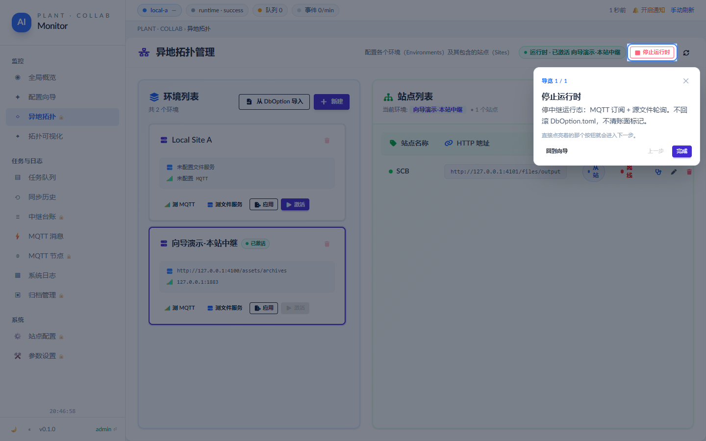

*导览：点亮着的「停止运行时」——停中继运行态，不回滚 DbOption.toml，不清账面标记。*

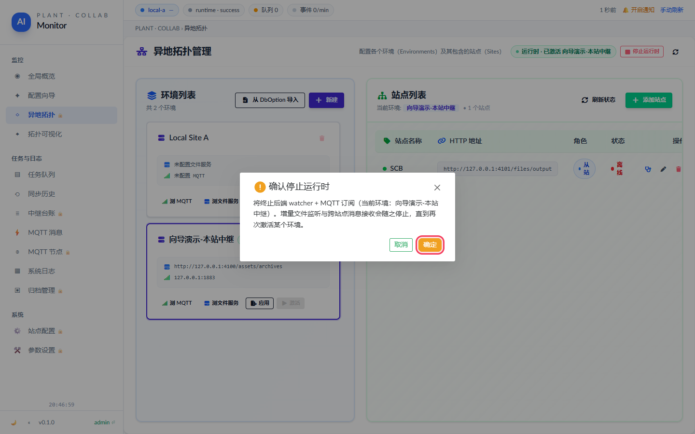

*确认后后端停掉 MQTT 订阅与源文件轮询。*

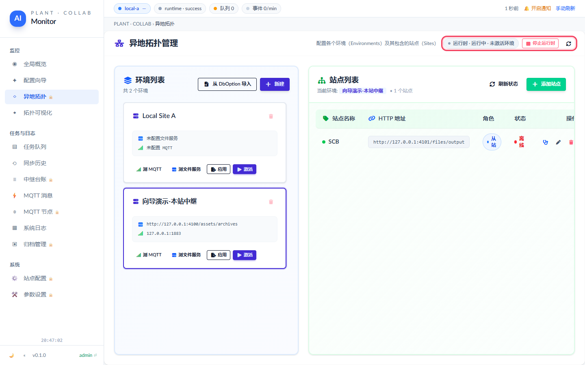

*停止后的真实状态：pill「运行时 · 运行中 · 未激活环境 停止运行时」，后端 `runtime.active = false`。*

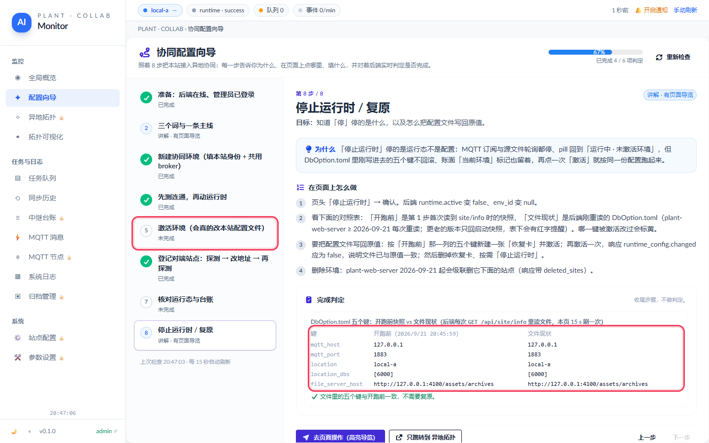

*停止后向导第 5 步 `todo`、第 7 步 `todo`（运行态没了），但文件还是第 5 步改过的那份——所以还要复原。*

停完后端 `runtime.active = false`、`env_id = null`，账面 `envs[].active` 仍指向 `env-1789994779`，文件里 `location_dbs` 仍是 `[6000, 6001]`——这就是「停的是运行态不是配置」。

**复原**按向导说的做：用开跑前的五个键新建一张「恢复卡」→ 激活（`changed: true`，写回）→ 再激活一次（`changed: false`，说明文件已与原值一致）→ 停止运行时 → 删掉演示卡与恢复卡。本教程的脚本在收尾时就是这么做的，两站都做，结果见附录 B；自己手动做时在页面上新建 / 激活两次即可，`changed` 的值在「激活环境」结果条与 `runtime_config` 里都看得到。

## 附录 A · 向导的判定在每一步之后长什么样

向导右上角的进度和左侧每一步的状态都是对着后端实时算的。下面是这一跑每做完一件事回到向导时读到的状态（`done` 已完成 / `todo` 未完成 / `info` 讲解页 / `locked` 需先登录）：

| 做完什么 | 1 准备 | 2 三个词与一条主线 | 3 新建协同环境 | 4 先测连通 | 5 激活环境 | 6 登记对端站点 | 7 核对运行态与台账 | 8 停止运行时 / 复原 | 进度 |
|---|---|---|---|---|---|---|---|---|---|
| login | `done` | `info` | `todo` | `todo` | `todo` | `todo` | `todo` | `info` | 已完成 1 / 6 项判定 |
| create-env | `done` | `info` | `done` | `todo` | `todo` | `todo` | `todo` | `info` | 已完成 2 / 6 项判定 |
| probe | `done` | `info` | `done` | `done` | `todo` | `todo` | `todo` | `info` | 已完成 3 / 6 项判定 |
| activate | `done` | `info` | `done` | `done` | `done` | `todo` | `done` | `info` | 已完成 5 / 6 项判定 |
| sites | `done` | `info` | `done` | `done` | `done` | `done` | `done` | `info` | 已完成 6 / 6 项判定 |
| stop | `done` | `info` | `done` | `done` | `todo` | `done` | `todo` | `info` | 已完成 4 / 6 项判定 |

这一跑真实发生的步骤（`docs/e2e-smoke/collab-guide-live-tutorial-result.json` 里有完整版）：

| 步骤 | 结果 |
|---|---|
| `guide-open` | statuses: `{"prepare":"todo","concepts":"info","create-env":"locked","probe":"locked","activate":"locked","sites":"locked","verify":"locked","stop":"info"}` |
| `login` | statuses: `{"prepare":"done","concepts":"info","create-env":"todo","probe":"todo","activate":"todo","sites":"todo","verify":"todo","stop":"info"}`，progress: `已完成 1 / 6 项判定` |
| `concepts-tour` | done: `true` |
| `create-env` | id: `env-1789994779`，prefill: `{"file_server_host":"http://127.0.0.1:4100/assets/archives","location":"local-a","location_dbs":"6000","mqtt_host":"127.0.0.1","mqtt_port":"1883"}`，stored: `{"mqtt_host":"127.0.0.1","mqtt_port":1883,"file_server_host":"http://127.0.0.1:4100/assets/archives","location":"local-a","location_dbs":[6000,6001]}`，autoSites: `[{"id":"site-1789994779","name":"SCB","http_host":"http://localhost:4180"}]` |
| `probe` | mqtt: `测 MQTT：目标可达 · 127.0.0.1:1883 · 0 ms 20:46:25`，http: `测文件服务：目标可达 · http://127.0.0.1:4100/assets/archives · HTTP 200 · 2 ms 20:46:25`，statuses: `{"prepare":"done","concepts":"info","create-env":"done","probe":"done","activate":"todo","sites":"todo","verify":"todo","stop":"info"}` |
| `activate` | dialog: `确认激活环境 将把环境「向导演示-本站中继」设为后端当前运行环境：plant-web-server 会把 mqtt_host / mqtt_port / file_server_host / location / location_dbs 写进本站 DbOption.toml（环境上没有的键不动），再起 / 重建中继运行态（MQTT 订阅 + 源文件轮询），立即生效；旧 plant-model-gen 后端会写入 DbOption.toml 并在进程内重启 watcher + MQTT 订阅。 取消 确定`，response: `{"envId":"env-1789994779","status":200,"relay":true,"runtime_config":{"changed":true,"keys":["mqtt_host","mqtt_port","file_server_host","location","location_…`，runtime: `{"active":true,"active_task_count":32,"env_count":2,"env_id":"env-1789994779","mode":"standalone-real","mqtt_connected":true,"relay":true,"relay_location":"l…`，siteInfoAfter: `{"mqtt_host":"127.0.0.1","mqtt_port":1883,"file_server_host":"http://127.0.0.1:4100/assets/archives","location":"local-a","location_dbs":[6000]}`，tomlAfter: `{"mqtt_host":"127.0.0.1","mqtt_port":"1883","file_server_host":"http://127.0.0.1:4100/assets/archives","location":"local-a","location_dbs":[6000,6001]}`，siteInfoTracksFile: `false` |
| `site-actions` | rows: `["SCB local-a http://localhost:4180"]`，guideProbeBefore: `目标不可达：HTTP 404 · http://localhost:4180/metadata.json · HTTP 404 · 1 ms`，autoHost: `http://localhost:4180`，probeBefore: `{"summary":"不可达","title":"后端探测：目标不可达：HTTP 404 · http://localhost:4180/metadata.json · HTTP 404 · 1 ms"}`，newHost: `http://127.0.0.1:4101/files/output`，savedToBackend: `true`，probeAfter: `{"summary":"可达 · 2 ms","title":"后端探测：目标可达 · http://127.0.0.1:4101/files/output/metadata.json · HTTP 200 · 2 ms"}` |
| `peer-activate` | api: `http://127.0.0.1:4101`，config: `{"mqtt_host":"127.0.0.1","mqtt_port":1883,"file_server_host":"http://127.0.0.1:4101/assets/archives","location":"local-b","location_dbs":[]}`，envId: `env-1789994809`，status: `200`，relay: `true`，runtime_config: `{"changed":false,"keys":["mqtt_host","mqtt_port","file_server_host","location"],"path":"runtime/local-collab/site-b/DbOption.toml"}`，runtime: `{"active":true,"active_task_count":11,"env_count":1,"env_id":"env-1789994809","mode":"standalone-real","mqtt_connected":true,"relay":true,"relay_location":"l…` |
| `verify` | chips: `active · true relay · true mqtt_connected · true env · 向导演示-本站中继 relay_location · local-a relay broker · 127.0.0.1:1883 mode · standalone-real`，ledger: `中继台账（GET /api/remote-sync/ledger/summary） rows 10 changes 142 problems 0 watermarks 2 最近广播 2026/09/20 00:00 最近接收 2026/09/21 20:22`，runtime: `{"active":true,"active_task_count":32,"env_count":2,"env_id":"env-1789994779","mode":"standalone-real","mqtt_connected":true,"relay":true,"relay_location":"l…`，ledgerSummary: `{"by_direction_status":[{"count":4,"direction":"inbound","verify_status":"ok"},{"count":6,"direction":"outbound","verify_status":"ok"}],"changes_total":142,"…` |
| `stop-guide` | snapshot: `键 开跑前（2026/9/21 20:45:59） 文件现状 mqtt_host 127.0.0.1 127.0.0.1 mqtt_port 1883 1883 location local-a local-a location_dbs [6000] [6000] file_server_host http://127.0.0.1:4100/assets/archives http://127.0.0.1:4100/assets/archives`，verdict: `{"kind":"same","text":"文件里的五个键与开跑前一致，不需要复原。"}`，tomlNow: `{"mqtt_host":"127.0.0.1","mqtt_port":"1883","file_server_host":"http://127.0.0.1:4100/assets/archives","location":"local-a","location_dbs":[6000,6001]}`，fileReallyDiffers: `true` |
| `stop-runtime` | pill: `运行时 · 运行中 · 未激活环境 停止运行时`，runtime: `{"active":false,"active_task_count":32,"env_count":2,"env_id":null,"mode":"standalone-real","mqtt_connected":true,"relay":false,"relay_location":null,"relay_…`，ledgerEnvId: `env-1789994779`，siteInfoAfter: `{"mqtt_host":"127.0.0.1","mqtt_port":1883,"file_server_host":"http://127.0.0.1:4100/assets/archives","location":"local-a","location_dbs":[6000]}` |

页面在这一跑里发出的写请求（`GET` 不计）：

- `POST /api/admin/auth/login → 200`
- `POST /api/remote-sync/envs → 200`
- `POST /api/remote-sync/envs/{id}/sites → 200`
- `POST /api/remote-sync/envs/{id}/test-mqtt → 200`
- `POST /api/remote-sync/envs/{id}/test-http → 200`
- `POST /api/remote-sync/envs/{id}/activate → 200`
- `POST /api/remote-sync/sites/{id}/test-http → 200 ×3`
- `PUT /api/remote-sync/sites/{id} → 200`
- `POST /api/remote-sync/runtime/stop → 200`

## 附录 B · 收尾把两站恢复成什么样

教程会真的改两站——包括 `DbOption.toml`——所以脚本跑完必须能还原。核对方式：env 集合、运行态 env、账面「当前环境」标记三样跟开跑前逐一对比；文件那一项靠「用开跑前的五个键建一张临时卡激活写回，再激活一次看 `changed = false`」——第二次一个字节都没改，说明文件已经与原值一致。这正是向导第 8 步教的复原法。

### 本站 Site A（`http://127.0.0.1:4100`）

| 核对项 | 结果 |
|---|---|
| 本轮的激活是否改写过 DbOption.toml | 是 |
| DbOption.toml 已写回原值（第二次激活 `changed = false`） | 是 |
| 直接读文件核对：五个键与开跑前逐键相等 | 是（`location_dbs = [6000]`） |
| env 集合与开跑前一致 | 是 |
| 运行态 env 与开跑前一致 | 是 |
| 账面「当前环境」标记与开跑前一致 | 是 |
| 残留的 env | 无 |
| 收尾后 `runtime.active` | `false` |

收尾动作依次是：

- `delete-site` · id `site-1789994779` → HTTP 200
- `delete-demo-env` · id `env-1789994779` → HTTP 200
- `create-restore-env` · id `env-1789994827` → HTTP 200
- `activate-restore-env` · id `env-1789994827` → HTTP 200，runtime_config `{"changed":true,"keys":["mqtt_host","mqtt_port","file_server_host","location","location_dbs"],"path":"runtime/local-collab/site-a/DbOption.toml"}`
- `activate-restore-env-verify` · id `env-1789994827` → HTTP 200，runtime_config `{"changed":false,"keys":["mqtt_host","mqtt_port","file_server_host","location","location_dbs"],"path":"runtime/local-collab/site-a/DbOption.toml"}`
- `stop-runtime` → HTTP 200
- `delete-restore-env` · id `env-1789994827` → HTTP 200

### 对端 Site B（`http://127.0.0.1:4101`）

| 核对项 | 结果 |
|---|---|
| 本轮的激活是否改写过 DbOption.toml | 否 |
| DbOption.toml 已写回原值（第二次激活 `changed = false`） | 不需要（没改过） |
| env 集合与开跑前一致 | 是 |
| 运行态 env 与开跑前一致 | 是 |
| 账面「当前环境」标记与开跑前一致 | 是 |
| 残留的 env | 无 |
| 收尾后 `runtime.active` | `false` |

收尾动作依次是：

- `delete-demo-env` · id `env-1789994809` → HTTP 200
- `stop-runtime` → HTTP 200

页面 JS 报错（pageerror）：0 条。

> 自己手动操作真实环境时同一招管用：**动配置之前先把向导第 1 步「本站身份」卡里的五个键记下来**（向导会自动快照到第 8 步），出事就建一张填着原值的环境点「激活」写回去；「从 DbOption 导入」那张卡不带连接参数，退不回任何东西。

