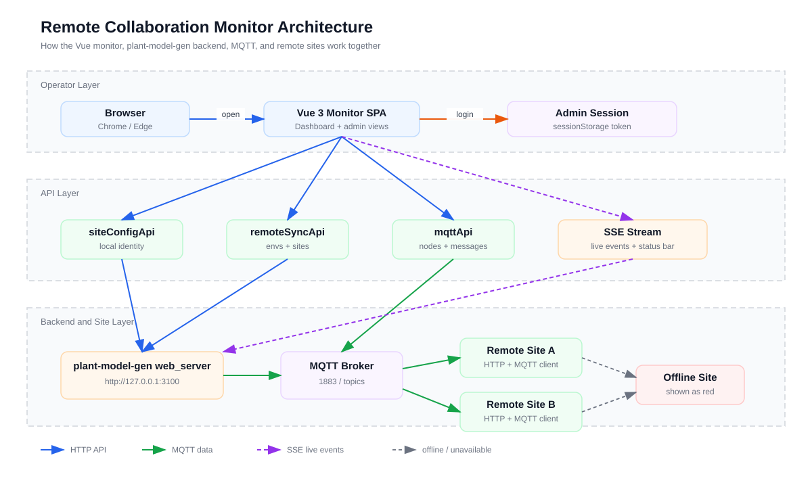
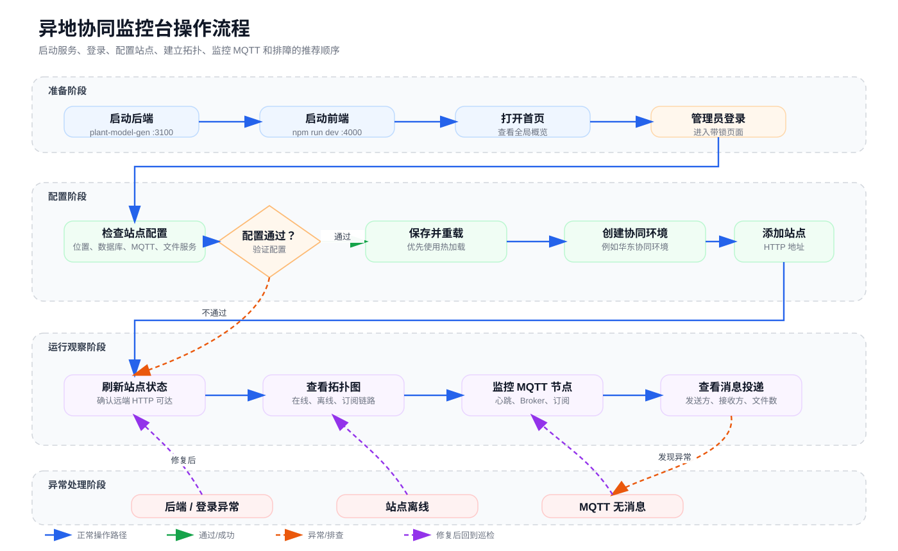

# 异地协同监控台使用教程

> 适用对象：需要配置、观察和排查异地协同站点的实施/运维人员。  
> 预计用时：20-30 分钟。  
> 验证方式：本文截图使用 Chrome DevTools Protocol + Playwright 在本地前端页面实测采集。

## 你将学会

- 启动 `plant-collab-monitor` 前端和 `plant-model-gen` 后端。
- 登录管理员功能区，并理解哪些页面需要管理员权限。
- 在“站点配置”里确认本机项目、数据库、MQTT 和文件服务参数。
- 在“异地拓扑”里创建环境和站点，并检查站点在线状态。
- 在“拓扑可视化”和“MQTT 节点”里观察跨站点同步链路。
- 根据常见异常现象快速定位后端、登录、MQTT 或站点配置问题。

## 整体架构

异地协同监控台本身只负责前端展示、管理员登录状态和 API 调用编排；真正的数据读写、站点配置、MQTT broker 和跨站点同步都由 `plant-model-gen` 的 `web_server` 提供。



读图时先抓住三条线：

- 蓝色是 HTTP API：页面通过 `src/api/*` 调用后端。
- 绿色是 MQTT 数据：主站和从站通过 Broker 交换节点心跳和消息投递状态。
- 紫色是 SSE 事件：实时日志和状态栏事件来自后端流式推送。

## 1. 启动前准备

异地协同监控台是独立 Vue 3 SPA，后端只依赖 `plant-model-gen` 的 `web_server`。前端默认监听 `http://localhost:4000`，后端默认监听 `http://127.0.0.1:3100`。

先启动后端：

```powershell
cd ..\plant-model-gen
$env:ADMIN_USER='admin'
$env:ADMIN_PASS='admin'
cargo run --bin web_server --features web_server
```

再启动前端：

```powershell
cd ..\plant-collab-monitor
npm install
npm run dev
```

打开浏览器访问：

```text
http://localhost:4000
```

> **提示：** 如果只启动前端，页面仍能打开，但接口会显示 502/断连。教程截图里的功能页面使用了 CDP mock 数据演示；真实使用时请先启动后端。

## 2. 先看全局概览

进入首页后，先看“全局概览”。这里用于判断系统是否正常联通，包括当前站点、同步引擎、MQTT 节点数、任务队列、24 小时任务量和失败数。

本页应优先确认站点身份、同步引擎、MQTT 节点、任务队列和最近事件是否持续刷新。

重点看三处：

- 顶部状态栏：显示当前站点、运行状态、任务队列和 1 分钟事件数。
- 中间指标卡：快速确认同步引擎、MQTT 节点和任务失败情况。
- 最近事件：用于确认同步流是否持续有新事件进入。

如果顶部出现红色后端连接横幅，优先检查 `plant-model-gen` 后端是否在 `3100` 端口运行。

## 3. 登录管理员功能区

侧栏里带锁的页面需要管理员权限，例如“异地拓扑”“MQTT 节点”“站点配置”“参数设置”等。未登录时点击这些页面，会回到全局概览并弹出管理员登录框。

未登录访问管理员页面时，系统会弹出登录框并在登录后回跳原目标页面。

默认本地联调账号来自后端环境变量：

```text
用户名：admin
密码：admin
```

登录成功后，系统会回到刚才被拦截的目标页面。比如从“异地拓扑”触发登录，成功后会自动返回 `/topology`。

> **排查：** 如果登录按钮一直失败，确认后端启动命令里已经设置 `ADMIN_USER` 和 `ADMIN_PASS`，并检查前端代理目标 `VITE_API_TARGET` 是否指向 `http://127.0.0.1:3100`。

## 4. 配置本站参数

首次使用建议先打开“站点配置”。这里定义当前站点在协同网络里的身份，以及数据库、文件服务和 MQTT 参数。

站点配置页应重点检查项目、位置、数据库、MQTT 和文件服务参数。

建议按这个顺序检查：

1. 项目设置：确认 `项目路径`、`项目名称`、`项目代码` 和 `包含的项目列表`。
2. 位置和数据库：确认 `站点位置标识`，例如 `sjz`，以及本机负责的数据库编号。
3. 数据库连接参数：确认数据库 IP、端口、用户名和密码。
4. MQTT 参数：确认 `mqtt_host` 和 `mqtt_port`，默认端口通常是 `1883`。
5. 文件服务参数：确认其他站点能访问当前站点文件服务地址。

配置完成后，建议依次点击：

- `验证配置`：只检查参数是否可用，不写入配置。
- `保存配置`：保存当前表单。
- `重载配置`：让支持热加载的字段即时生效。

> **注意：** 站点位置标识会参与 MQTT topic、站点拓扑和同步消息识别。上线后不要随意改名，除非同步修改所有站点引用。

## 5. 建立异地拓扑

打开“异地拓扑”。左侧是环境列表，右侧是该环境下的站点列表。环境可以理解为一组参与同一次异地协同的站点集合。

异地拓扑页左侧是环境列表，右侧是当前环境下的站点列表和状态操作。

典型操作流程：

1. 点击 `新建` 创建环境，例如“华东协同环境”。
2. 选中环境卡片。
3. 在右侧点击 `添加站点`。
4. 填写站点名称、位置标识和 HTTP 地址。
5. 保存后点击 `刷新状态`，确认站点是否在线。

站点列表中建议重点看：

- `HTTP 地址`：其他站点访问该站点后端的入口。
- `角色`：主站/从站只影响协作职责展示，不替代后端权限。
- `状态`：用于判断远端站点是否可连通。

> **实践建议：** 先只添加一个主站和一个从站，确认同步链路稳定后，再把其他施工站、审图站逐步纳入环境。

## 6. 查看拓扑可视化

“拓扑可视化”用于观察站点、MQTT 订阅和消息流向。它比表格更适合现场排查：哪个站点离线、哪条链路中断、消息有没有流向某个从站，一眼就能看出来。

拓扑可视化页用颜色区分主站、从站、离线站点、订阅链路和消息流。

图例含义：

- 紫色：主节点或环境节点。
- 绿色：从节点在线。
- 红色：站点离线。
- 绿色连线：已订阅。
- 蓝色连线：在线但未订阅。
- 灰色连线：离线链路。
- 黄色流线：消息流。

右下角有缩放和拖动画布按钮。现场投屏时，可以放大某个环境，只展示当前排查的站点链路。

## 7. 监控 MQTT 节点

打开“MQTT 节点”。这个页面用于确认 Broker、订阅客户端、在线节点和消息投递状态。

MQTT 节点页会集中展示节点列表、订阅状态、心跳时间和消息投递详情。

建议按这个顺序检查：

1. 顶部“节点角色”：确认本站是主站还是从站。
2. 顶部“订阅”：确认订阅客户端是否已订阅。
3. 左侧节点卡片：查看每个站点的位置、MQTT 地址、消息数量和最后心跳。
4. 右侧消息投递状态：选中某个节点后，查看消息发出方、数据库范围和接收状态。

如果节点显示离线，先确认：

- 远端站点后端是否运行。
- 两端 `mqtt_host` / `mqtt_port` 是否一致。
- 防火墙是否放行 MQTT 端口。
- 站点位置标识是否与拓扑里填写的一致。

## 8. 日常巡检清单

每天开始协同时，建议按下面顺序快速巡检：



1. 打开“全局概览”，确认后端连接、任务队列和失败数。
2. 打开“站点配置”，确认当前站点位置和 MQTT 参数没有误改。
3. 打开“异地拓扑”，确认所有参与站点在线。
4. 打开“拓扑可视化”，确认主站、从站和订阅链路都符合预期。
5. 打开“MQTT 节点”，确认最后心跳时间和消息投递状态。
6. 如有异常，再进入“系统日志”“同步历史”进一步定位。

## 9. 常见问题

### 页面能打开，但所有接口失败

通常是后端未启动或前端代理目标错误。检查：

```powershell
Get-NetTCPConnection -LocalPort 3100
```

如果没有监听，重新启动 `plant-model-gen` 的 `web_server`。

### 登录框提示环境变量占位值

登录框里显示 `ADMIN_USER 环境变量值`、`ADMIN_PASS 环境变量值` 是占位提示，不是自动填充。请手动输入后端启动时配置的账号密码。

### 访问管理员页面后又回到首页

这是正常的登录拦截流程。登录成功后会自动返回原目标页面。如果登录后仍被拦截，检查浏览器是否禁用了 `sessionStorage`。

### MQTT 节点在线数为 0

先检查 Broker 是否启动，再检查各站点是否订阅成功。主站通常需要先启动 Broker，从站再连接主站 MQTT 地址。

### 拓扑里站点在线，但消息没有流动

优先检查订阅状态和 topic。站点在线只代表 HTTP 可达，不代表 MQTT 订阅已经建立。

## 10. 验证本教程截图的方式

本教程截图通过本地 Chrome/CDP 验证生成，关键验证点包括：

- 使用 Playwright 打开 `http://localhost:4000`。
- 通过 CDP `Page.getLayoutMetrics` 确认页面完成布局。
- 截取全局概览、管理员登录、异地拓扑、拓扑可视化、MQTT 节点、站点配置 6 个页面。
- 对 API 使用只读 mock 数据，避免写入真实后端配置。

截图只用于说明页面操作。真实联调时，应使用 `plant-model-gen` 后端和现场站点数据重新验证。

