# 异地部署操作教程 · 真实后端实操版（plant-web-server 中继站点）

> 适用对象：要把一个协同环境推上站点后端运行时、或排查站点连通性的实施 / 运维人员。
> 预计用时：10–15 分钟。
> 生成方式：本文由 `scripts/topology-deploy-live-tutorial.mjs` 于 2026-09-18 自动生成——Playwright 开真实 Chrome，把下面每一步**真的在页面上做了一遍**，后端是真后端（`http://127.0.0.1:4100`，plant-web-server 中继模式），截图里的每一条提示都是它当时的真实响应。
> 与 `docs/tutorials/topology-deploy-tutorial.md` 的分工：那一份用 mock 喂页面、胜在数据整齐可重复；这一份胜在真实，包括真实的失败提示。
> 收尾：本次新建的环境与站点跑完即删；激活改写过的 `DbOption.toml` 用开跑前记下的五个键写回原值，并再激活一次确认无差；运行态恢复原状（核对结果见文末附录 B）。

## 你将学会

- 给本站登记一张「从 DbOption 导入」的卡，以及手填新建一个协同环境——填的是**本站身份 + 共用 broker**。
- 用「测 MQTT / 测文件服务 / 站点探测」在动运行时之前确认 broker、本站 CBA 目录、对端站点可达。
- 分清「应用」（只落账）与「激活」（写 `DbOption.toml` 五个键 + 起 / 重建中继运行态），并看懂运行时 pill、「已激活」徽标与 `runtime/status` 的字段。
- 停止运行时、登记 / 编辑对端站点，以及动手之前怎么给自己留一条退路。

## 0. 三个词与一条主线

| 词 | 是什么 | 在页面上 |
|---|---|---|
| **环境（Env）** | 本站怎么接入协同：共用 broker（`mqtt_host` / `mqtt_port`）+ 本站身份（`location` / 自有库 `location_dbs` / 对端来下载 CBA 的 `file_server_host`）。激活写进本站 `DbOption.toml` 的就是这五个键 | 左侧卡片 |
| **站点（Site）** | 环境下登记的一个对端节点（`location` + `http_host`），给拓扑、探测、详情用；中继靠 MQTT 发现对端，不靠它 | 右侧表格的一行 |
| **运行时（Runtime）** | 本站的中继运行态：MQTT 订阅（收对端广播）+ 源文件轮询（发本站变更）此刻按哪个环境在跑 | 页头 pill + 卡片「已激活」徽标 |

一次完整的部署就是：**建环境 → 测连通 → 激活 → 看 pill 与 `runtime/status` 确认 →（需要时）停止**。下面按这个顺序走。

## 0.1 这一跑的现场

| 项 | 值 |
|---|---|
| 后端 | `http://127.0.0.1:4100`（plant-web-server，`identity.mode = detached`，site_id `local-a`） |
| 对端（教程里扮演另一个站点 Site B） | `http://127.0.0.1:4101` |
| 本站 DbOption.toml 的五个连接键（开跑前） | broker `127.0.0.1:1883` · location `local-a` · 自有库 `[6000]` · CBA `http://127.0.0.1:4100/assets/archives` |
| 开跑前环境数 / 运行态 env / 账面当前环境 | 0 张 / 无 / 无 |
| 开跑前运行时 | `active: false`、`relay: false`、`mode: standalone-real` |
| 生成时间 | 2026/9/18 09:22:30（本机时区） |

> 本机这套两站环境由 `scripts/local-remote-collab-setup.ps1` 生成在 `../plant-web-server/runtime/local-collab/`（模板 `../plant-web-server/db_options/DbOption.toml`，两站 `--repo-root` 也是 plant-web-server；2026-09-18 前在 `../plant-model-gen` 下），起法见那里的 `COMMANDS.md`。**别把本教程的脚本指向生产后端**——它会真的建环境、真的改配置。

## 1. 登录并进入「异地拓扑」

`/topology` 是管理员页面。未登录直接打开，监控台会记住你要去的地址、弹出「管理员登录」，登录成功后自动回到 `/topology`。账号密码就是后端进程启动时的 `ADMIN_USER` / `ADMIN_PASS` 环境变量（本机两站的启动脚本里写死为 `admin` / `admin`），输入框里的「ADMIN_USER 环境变量值」只是占位提示。

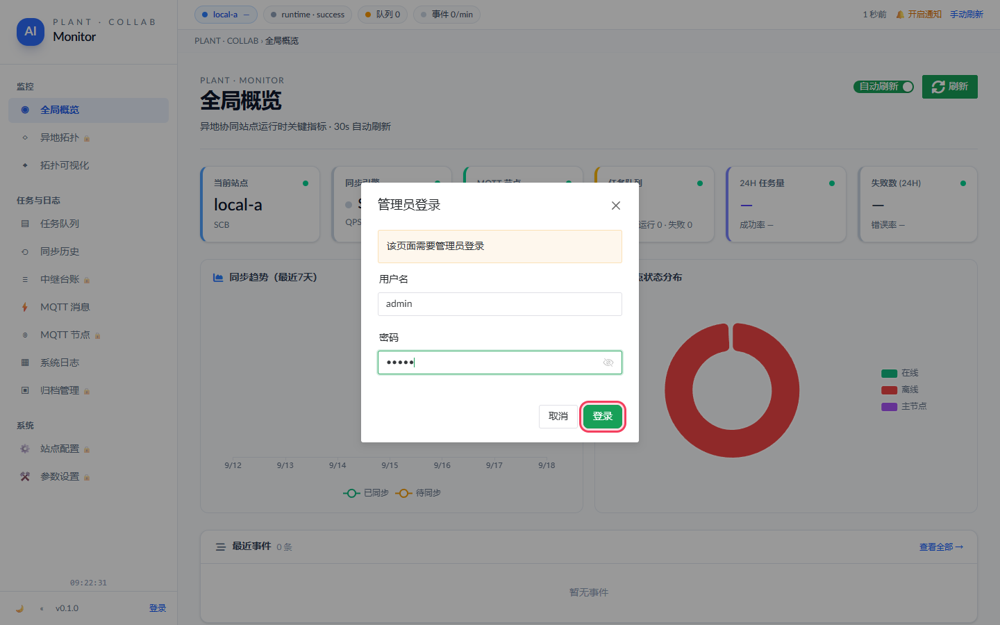

*直接访问 `/topology` 被拦下，填入管理员账号密码后点「登录」。*

## 2. 读懂首屏：运行时 pill 与「已激活」徽标

左边是**环境（Env）**列表，右边是选中环境下的**站点（Site）**。页头右侧那颗胶囊是**运行时 pill**，它每 30 秒读一次 `GET /api/remote-sync/runtime/status`，回答「本站的中继运行态此刻按哪个环境在跑」；鼠标停上去能看到 `env_id`、MQTT 连接状态、`mode: standalone-real`（这就是 plant-web-server）。

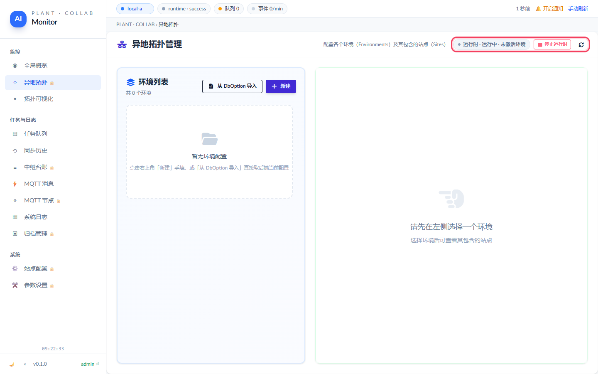

*登录后的首屏。红框：运行时 pill 与环境列表。*

这一跑开始时后端的真实状态：pill 是「运行时 · 运行中 · 未激活环境 停止运行时」，环境卡片 0 张，中继运行态**没有**在跑（`active: false`）——MQTT 订阅与源文件轮询都没起。

本站（Site A）自己的 `DbOption.toml` 里此刻是：broker `127.0.0.1:1883`、location `local-a`、自有库 `[6000]`、CBA 下载地址 `http://127.0.0.1:4100/assets/archives`（`GET /api/site/info` 读到的）。记住这五个值——**激活写的就是这五个键**，本教程收尾也要拿它们把文件写回去。

- 每张卡片下方 4 个动作按钮：**测 MQTT / 测文件服务 / 应用 / 激活**，这就是「部署动作面」。
- 有环境被激活时，它的卡片右上角会挂绿色「已激活」徽标，自己的「激活」按钮置灰（防重复激活），页头同时出现「停止运行时」。
- 任何动作做完，监控台都会立刻重拉 `runtime/status` 与环境列表，不用手动刷新。

## 3. 「从 DbOption 导入」：给本站登记一张卡

点环境列表右上角的「从 DbOption 导入」，后端会读**它自己进程**那份 `DbOption.toml`，按本站 id 生成一张「本站登记卡」（工程名 / 工程码 / 工程路径、绑定端口、配置文件路径），id 固定是 `dboption-<本站 site_id>`，**重复导入只是覆盖同一张**。这一步不改写配置、也不激活运行时。

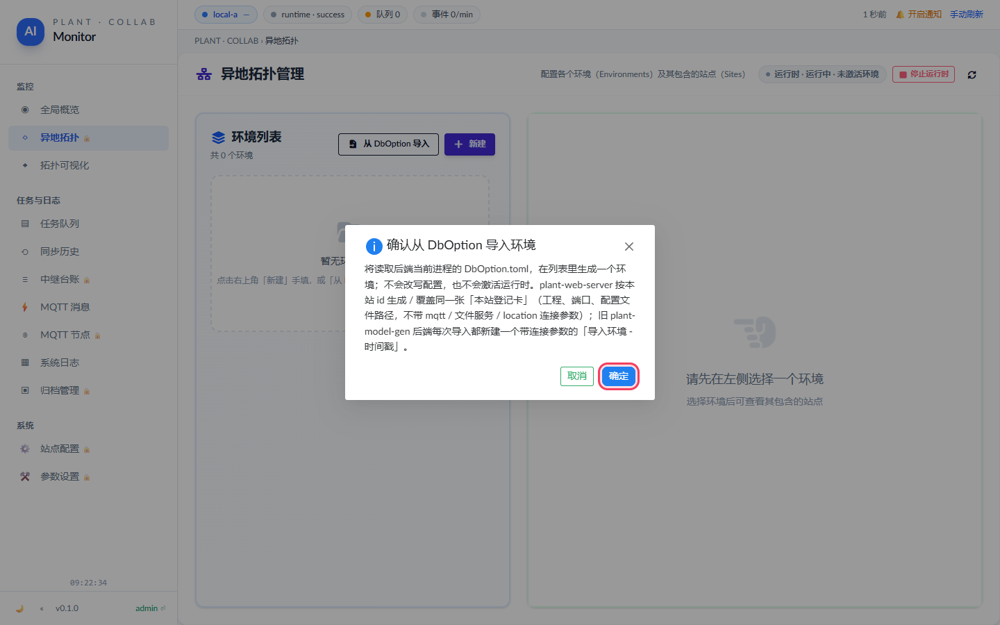

*弹窗写清楚读什么、不会改什么。点「确定」。*

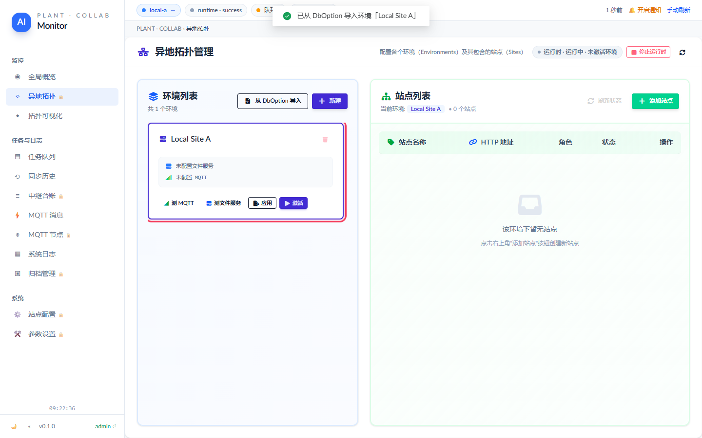

*导入成功：环境计数 +1，新卡自动被选中（蓝色边框），右侧切到它的站点列表。*

这一跑生成了「**Local Site A**」（id `dboption-local-a`）：工程 `SCB` / 工程码 `1516`、绑定 `127.0.0.1:4100`、配置文件 `runtime/local-collab/site-a/DbOption.toml`。

卡片上写着「未配置文件服务 / 未配置 MQTT」——**不是坏了**：plant-web-server 的导入卡**不带** `mqtt_host / mqtt_port / file_server_host / location / location_dbs`，那五个键仍然只在 `DbOption.toml` 里。所以对着这张卡点「激活」= **按文件现状原样起中继、一个键都不改**（激活响应里 `runtime_config.keys` 会是空的）；它不是配置快照，退不回任何东西。

> 想给自己留退路，记的是第 2 节那五个值（或直接备份 `DbOption.toml`）——本教程收尾就是这么复原的，见附录 B。

## 4. 手填新建一个协同环境（填的是本站身份 + 共用 broker）

真正要跑中继，点「新建」手填。**填的是本站怎么接入协同**，不是对端长什么样：共用 broker 的地址、本站的 `location`、本站的自有库、以及**对端来本站下载 CBA 的地址**（本站的 `/assets/archives`）。表单会用本站配置预填，通常只改 broker 地址和名字。保存后监控台会**自动把本站加为该环境的第一个站点**，右侧表格立刻能看到。

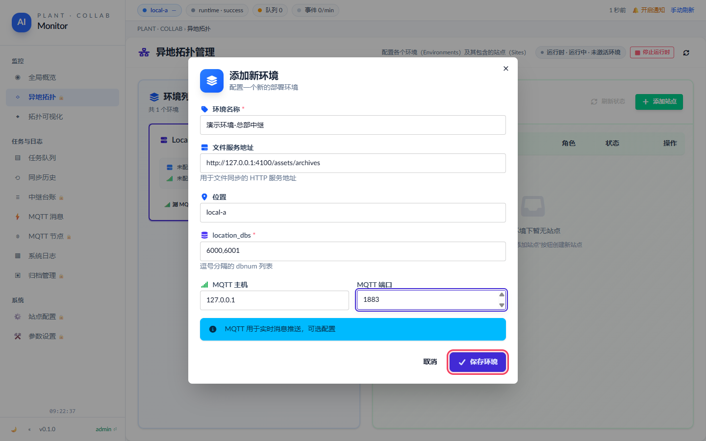

*填好本站身份与 broker 地址，然后点「保存环境」。*

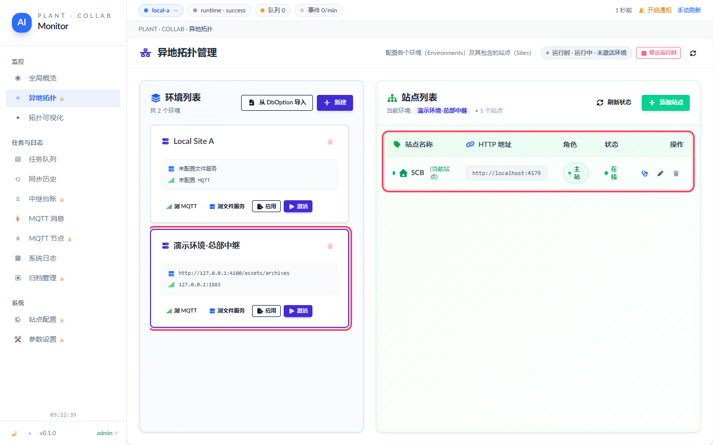

*保存后：新环境被选中，右侧自动加入了 1 个站点（本站）。*

| 字段 | 填什么 | 这一跑填的 |
|---|---|---|
| 环境名称 | 人能看懂的名字 | `演示环境-总部中继` |
| 文件服务地址（file_server_host） | **本站**的 CBA 目录地址：本站广播消息时带上它，**对端**从 `<它>/<file>.cba` 下载 | `http://127.0.0.1:4100/assets/archives` |
| MQTT 主机 / 端口 | 两站共用的 broker，`test-mqtt` 会 TCP 探它 | `127.0.0.1` / `1883` |
| 位置标识（location） | **本站**的 location，全网唯一；对端消息里 location 与本站相同的会被忽略 | `local-a` |
| 数据库编号（location_dbs） | **本站自有库**：只广播这些库的变更 | `6000, 6001`（比文件里多标了 `6001`，下一步好看出激活确实改了文件） |

## 5. 先测连通，再动运行时

激活之前先在卡片上点两下探测：**测 MQTT** 让后端 TCP 探 `mqtt_host:mqtt_port`（broker 通不通），**测文件服务** 让后端对 `file_server_host` 发一次 GET（本站的 `/assets/archives` 能不能被访问到——对端将来就是从这里下载 CBA 的）。结果以横条留在卡片里（绿 = 通，红 = 不通），右上角同时弹 toast。注意探测**由后端发起**，探的是「后端到目标」的网络，不是你浏览器到目标的。

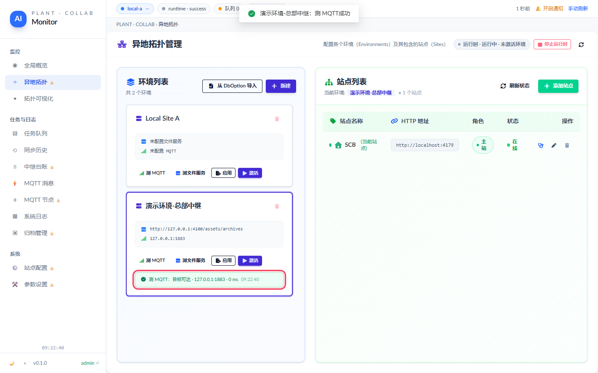

*「测 MQTT」的真实结果：测 MQTT：目标可达 · 127.0.0.1:1883 · 0 ms 09:22:40*

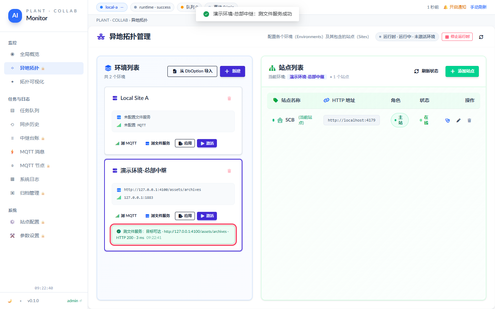

*「测文件服务」的真实结果：测文件服务：目标可达 · http://127.0.0.1:4100/assets/archives · HTTP 200 · 3 ms 09:22:41*

这一跑拿到的两条真实结果：

- 测 MQTT：`测 MQTT：目标可达 · 127.0.0.1:1883 · 0 ms 09:22:40`
- 测文件服务：`测文件服务：目标可达 · http://127.0.0.1:4100/assets/archives · HTTP 200 · 3 ms 09:22:41`

> 红条里会透出后端原话（`connection refused`、目标 URL、HTTP code、耗时），排网络问题直接照着看。红条只说明目标不通，不代表页面出错。本机两站共用一个 Mosquitto、CBA 目录里放了 `index.html`，所以这里两条都是绿的；真实部署里第一次点常常是红的——broker 端口没开、`/assets/archives` 没挂出来，都在这一步就能发现。

## 6. 激活环境（这一步会真的改本站配置文件）

**激活** = 让本站从此按这个环境跑中继。plant-web-server 分两步：先把环境的 `mqtt_host / mqtt_port / file_server_host / location / location_dbs` 写进本站 `DbOption.toml`（环境上没有的键不动，其余行与注释原样保留），再起 / 重建中继运行态——MQTT 订阅（收对端广播）+ 源文件轮询（发本站变更），**不用重启进程**。写不进文件或中继起不来，整条激活失败，不会留下「账面已激活、跑的还是旧配置」的中间态。这是整页最重的动作，所以有确认弹窗；当前已有运行态时弹窗还会点名它「会先被停止」。

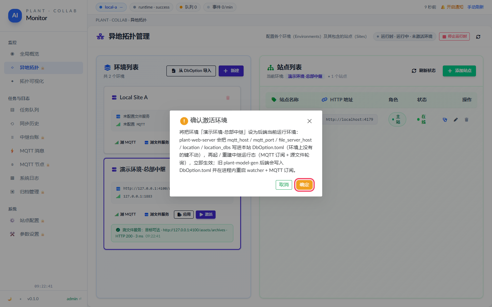

*确认弹窗把后果说清楚了再点「确定」。*

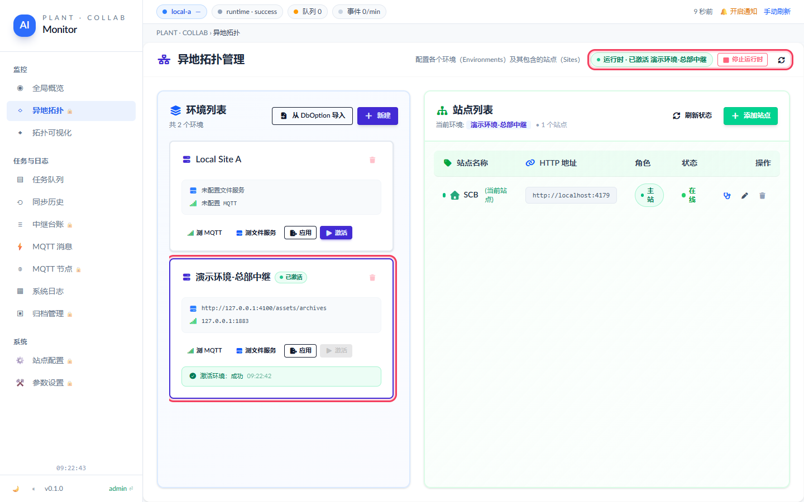

*激活后三处同时变：pill、绿色「已激活」徽标、卡片里的结果条。*

这一跑激活后从后端直接查到的事实（不是只看页面）：

- 页面发出的 `POST envs/env-1789694558/activate` 响应里 `runtime_config`：写了 `mqtt_host / mqtt_port / file_server_host / location / location_dbs` 这几个键到 `runtime/local-collab/site-a/DbOption.toml`，`changed: true`——文件**真的变了**（自有库从 `[6000]` 变成 `[6000, 6001]`，另四个键与原值相同）。
- `GET /api/remote-sync/runtime/status` → `active: true`、`env_id: env-1789694558`、`relay: true`、`mqtt_connected: true`，这次激活实际用的连接参数 `relay_location: local-a`、`relay_mqtt_host: 127.0.0.1`、`relay_mqtt_port: 1883`——对着它核对环境是否生效。
- 运行态上跑的 env（`env-1789694558`）与账面「当前环境」标记（`envs[].active`，`env-1789694558`）都指向页面上被点的这张卡。
- 卡片里的结果条：`激活环境：成功 09:22:42`

> `relay: true` 是中继模式（`sync_relay_mode = true`）的标志：这台后端不连 SurrealDB，靠 SQLite 台账 + MQTT 广播与对端协同；激活成功时台账三张表也一并建好，`/ledger`「中继台账」视图从此有数据可看。

> 对着真实后端点「激活」是真的改它的配置文件。联调前先确认端口后面是哪台实例（见 `HANDOFF.md`「先看清楚后端是谁」）。

## 7. 「应用」和「激活」差在哪

**应用（apply）** 在 plant-web-server 上**只落账**：把这张卡标为「当前环境」、记一条 apply 任务，**不写 `DbOption.toml`、不碰运行态**。**激活（activate）** 才是写盘 + 起 / 重建中继。所以这里的「应用」更像「先选中、稍后再切」的书签；要让连接参数真正生效，只有「激活」一条路。（旧 plant-model-gen 后端的「应用」会写文件不重启，监控台的确认弹窗把两种都写明了。）

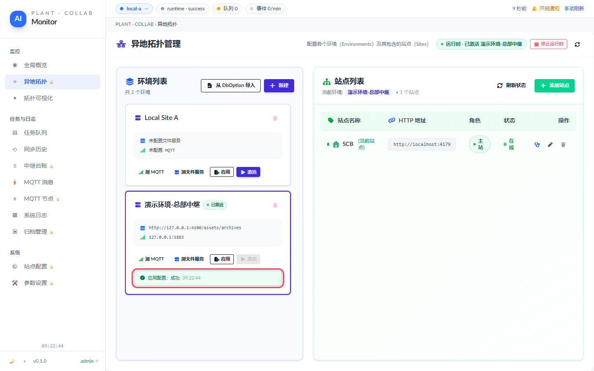

*「应用」的真实返回：应用配置：成功 09:22:44*

「应用」之后 `runtime/status` 的 `env_id` 仍是 `env-1789694558`，`relay_mqtt_host` 等一个都没变——它没碰运行态，也没有第二条 activate 那样的 `runtime_config` 写盘记录。

## 8. 站点这一侧：登记对端 → 探测不通 → 改地址 → 再探测

右侧表格是选中环境下的**站点**——登记的是对端节点（`location` + `http_host`），给拓扑图、探测和「查看站点详情」用；中继本身靠 MQTT 发现对端，不靠这张表。每行末尾两个动作：**探测**（让后端对这个站点的 `http_host` 拼上 `/metadata.json` 发一次 GET）和**编辑站点**（改名称 / 位置 / 负责 dbnums / HTTP 服务地址 / 备注）。探测同样由后端发起。下面故意把这条链走完整：先探一次不通的，再把地址改成对端（Site B）的，再探一次。

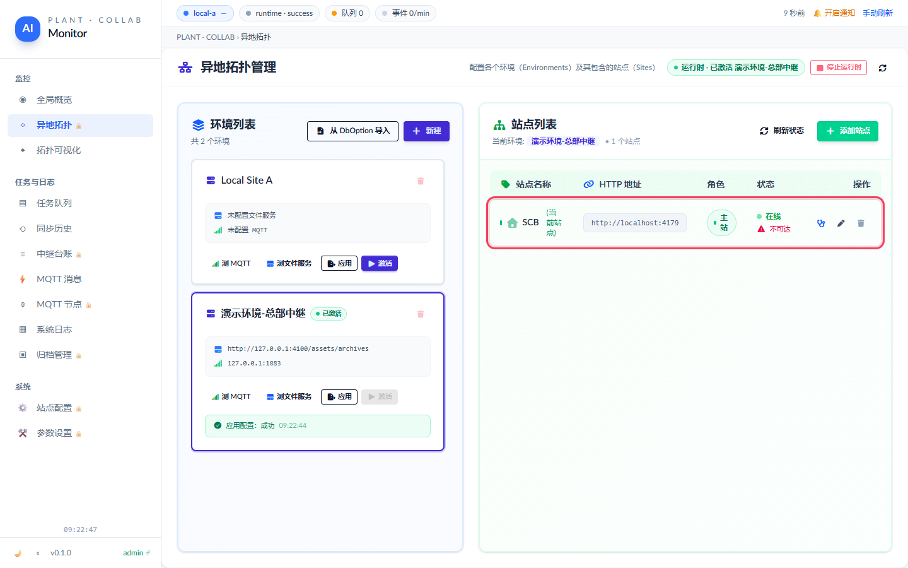

*第一次探测：后端探测：目标不可达：HTTP 404 · http://localhost:4179/metadata.json · HTTP 404 · 5 ms*

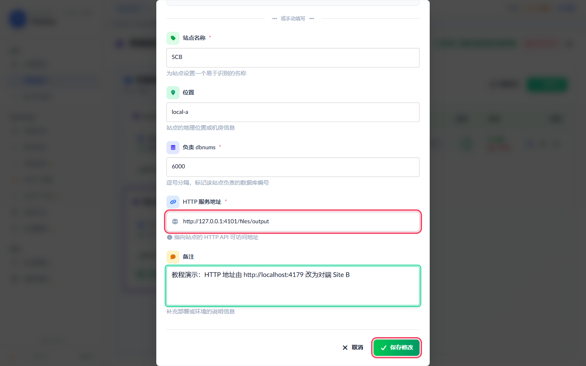

*把「HTTP 服务地址」改成对端真实可达的地址，点「保存修改」。*

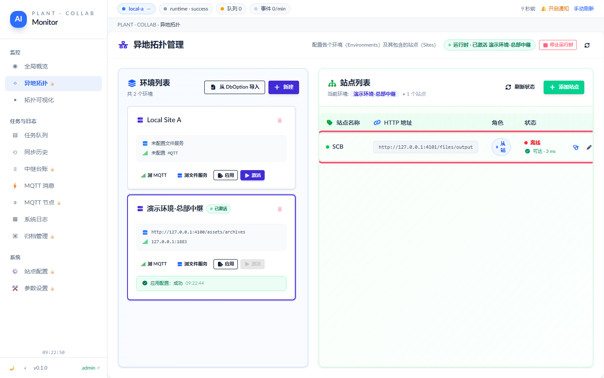

*第二次探测：后端探测：目标可达 · http://127.0.0.1:4101/files/output/metadata.json · HTTP 200 · 3 ms*

这一跑站点表有 1 行，唯一那行是保存环境时**自动加入的本站**，它的 HTTP 服务地址被填成了打开页面的那个地址（`http://localhost:4179`，也就是监控台自己）——所以第一次探测必然不通：

- 改之前：`后端探测：目标不可达：HTTP 404 · http://localhost:4179/metadata.json · HTTP 404 · 5 ms`
- 改成对端 `http://127.0.0.1:4101/files/output` 之后：`后端探测：目标可达 · http://127.0.0.1:4101/files/output/metadata.json · HTTP 200 · 3 ms`

保存后回查后端 `GET envs/{id}/sites`，`http_host` 与 `notes` **都已更新**——页面上的成功提示不等于后端真写了，这一步是回查过的。

> 记住这条：**自动加进来的那个站点指向的是你自己**，真要登记对端必须手动改成对端地址（对端 plant-web-server 的 `/files/output`，它下面有 `metadata.json`）。

## 9. 停止运行时

页头「停止运行时」让后端停掉中继运行态——MQTT 订阅与源文件轮询都停，`runtime.active` 变 `false`、pill 不再显示「已激活」。**停的是运行态，不是配置**：`DbOption.toml` 里刚写进去的五个键不会被回滚，账面上「当前环境」的标记（`envs[].active`）也还留着，再点一次「激活」就按同一份配置跑起来。

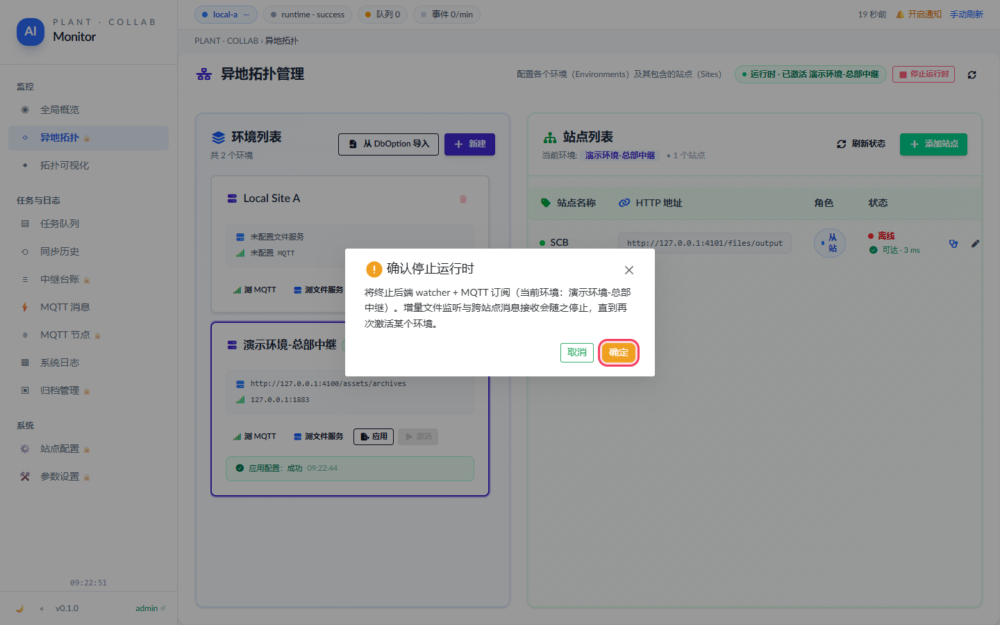

*确认后后端停掉 MQTT 订阅与源文件轮询。*

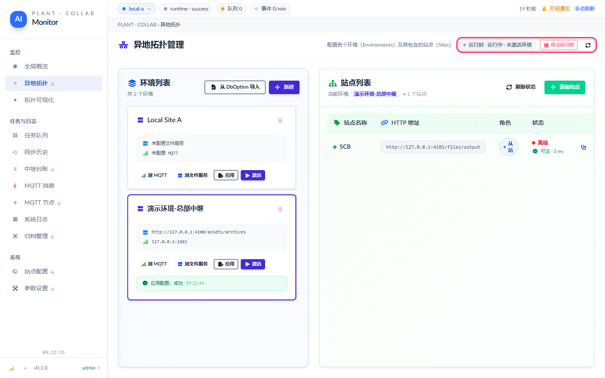

*停止后的真实状态：pill「运行时 · 运行中 · 未激活环境 停止运行时」，后端 `runtime.active = false`。*

停完后端 `runtime.active = false`、`env_id = null`，页面 pill 同步变成「运行时 · 运行中 · 未激活环境 停止运行时」（`running: true` 是进程活着，`未激活环境` 是中继没在跑）。账面上 `envs[].active` 仍指向 `env-1789694558`——这就是「停的是运行态不是配置」。要再跑起来，对着想用的环境卡再点一次「激活」。

## 附录 A · 这一跑真实发生了什么

教程里每张图都对应一次真实请求。下面是同一跑的机器记录，`docs/e2e-smoke/topology-deploy-live-tutorial-result.json` 里有完整版。

| 步骤 | 结果 |
|---|---|
| `first-screen` | pill: `运行时 · 运行中 · 未激活环境 停止运行时`，pillTitle: `后端运行时在跑，但没有已激活的环境；在环境卡片上点「激活」`，envCards: `0` |
| `import-from-dboption` | id: `dboption-local-a`，envName: `Local Site A`，preexisted: `false`，source: `DbOption`，hasConnectionKeys: `false`，config: `{"associated_project":{"config_path":"runtime/local-collab/site-a/DbOption.toml","repo_root":"D:\\work\\plant-code\\plant-web-server"},"bind_host":"127.0.0.1…` |
| `create-env` | id: `env-1789694558`，stored: `{"mqtt_host":"127.0.0.1","mqtt_port":1883,"file_server_host":"http://127.0.0.1:4100/assets/archives","location":"local-a","location_dbs":[6000,6001]}`，autoSites: `[{"id":"site-1789694558","name":"SCB","http_host":"http://localhost:4179"}]` |
| `probe` | mqtt: `测 MQTT：目标可达 · 127.0.0.1:1883 · 0 ms 09:22:40`，http: `测文件服务：目标可达 · http://127.0.0.1:4100/assets/archives · HTTP 200 · 3 ms 09:22:41` |
| `activate` | runtimeEnvId: `env-1789694558`，ledgerEnvId: `env-1789694558`，matchesDemoEnv: `true`，runtime: `{"active":true,"active_task_count":9,"env_count":2,"env_id":"env-1789694558","mode":"standalone-real","mqtt_connected":true,"relay":true,"relay_location":"lo…`，runtime_config: `{"changed":true,"keys":["mqtt_host","mqtt_port","file_server_host","location","location_dbs"],"path":"runtime/local-collab/site-a/DbOption.toml"}`，dialog: `确认激活环境 将把环境「演示环境-总部中继」设为后端当前运行环境：plant-web-server 会把 mqtt_host / mqtt_port / file_server_host / location / location_dbs 写进本站 DbOption.toml（环境上没有的键不动），再起 / 重建中继运行态（MQTT 订阅 + 源文件轮询），立即生效；旧 plant-model-gen 后端会写入 DbOption.toml 并在进程内重启 watcher + MQTT 订阅。 取消 确定`，banner: `激活环境：成功 09:22:42` |
| `apply` | dialog: `确认应用环境配置 将把环境「演示环境-总部中继」应用为后端当前配置：plant-web-server 只把它标记为当前环境并记一条 apply 任务，不写 DbOption.toml、不动运行态——要让连接参数落盘生效请用「激活」；旧 plant-model-gen 后端会把 mqtt_host / mqtt_port / file_server_host / location / location_dbs 写入 DbOption.toml，但不重启运行态。 取消 确定`，banner: `应用配置：成功 09:22:44`，runtimeUnchanged: `true`，runtime: `{"active":true,"active_task_count":10,"env_count":2,"env_id":"env-1789694558","mode":"standalone-real","mqtt_connected":true,"relay":true,"relay_location":"l…` |
| `site-actions` | rowCount: `1`，autoHost: `http://localhost:4179`，probeBefore: `{"summary":"不可达","title":"后端探测：目标不可达：HTTP 404 · http://localhost:4179/metadata.json · HTTP 404 · 5 ms"}`，newHost: `http://127.0.0.1:4101/files/output`，savedToBackend: `true`，probeAfter: `{"summary":"可达 · 3 ms","title":"后端探测：目标可达 · http://127.0.0.1:4101/files/output/metadata.json · HTTP 200 · 3 ms"}` |
| `stop-runtime` | pill: `运行时 · 运行中 · 未激活环境 停止运行时`，runtime: `{"active":false,"active_task_count":10,"env_count":2,"env_id":null,"mode":"standalone-real","mqtt_connected":true,"relay":false,"relay_location":null,"relay_…`，ledgerEnvId: `env-1789694558` |

页面在这一跑里发出的写请求（`GET` 不计）：

- `POST /api/admin/auth/login → 200`
- `POST /api/remote-sync/envs/import-from-dboption → 200`
- `POST /api/remote-sync/envs → 200`
- `POST /api/remote-sync/envs/{id}/sites → 200`
- `POST /api/remote-sync/envs/{id}/test-mqtt → 200`
- `POST /api/remote-sync/envs/{id}/test-http → 200`
- `POST /api/remote-sync/envs/{id}/activate → 200`
- `POST /api/remote-sync/envs/{id}/apply → 200`
- `POST /api/remote-sync/sites/{id}/test-http → 200 ×2`
- `PUT /api/remote-sync/sites/{id} → 200`
- `POST /api/remote-sync/runtime/stop → 200`

## 附录 B · 收尾把后端恢复成什么样

教程会真的改后端——包括 `DbOption.toml`——所以脚本跑完必须能还原，否则这份教程就是在给环境留垃圾。核对方式：env 集合、运行态 env、账面「当前环境」标记三样跟开跑前逐一对比；文件那一项靠「用开跑前的五个键建一张临时卡激活写回，再激活一次看 `changed = false`」——第二次一个字节都没改，说明文件已经与原值一致。

| 核对项 | 结果 |
|---|---|
| 本轮的激活是否改写过 DbOption.toml | 是（自有库多标了一个） |
| DbOption.toml 已写回原值（第二次激活 `changed = false`） | 是 |
| env 集合与开跑前一致 | 是 |
| 运行态 env 与开跑前一致 | 是 |
| 账面「当前环境」标记与开跑前一致 | 是 |
| 残留的 env | 无 |
| 收尾后 `runtime.active` | `false` |
| 页面 JS 报错（pageerror） | 0 条 |

收尾动作依次是：

- `delete-site` · id `site-1789694558` → HTTP 200
- `delete-demo-env` · id `env-1789694558` → HTTP 200
- `create-restore-env` · id `env-1789694576` → HTTP 200
- `activate-restore-env` · id `env-1789694576` → HTTP 200，runtime_config `{"changed":true,"keys":["mqtt_host","mqtt_port","file_server_host","location","location_dbs"],"path":"runtime/local-collab/site-a/DbOption.toml"}`
- `activate-restore-env-verify` · id `env-1789694576` → HTTP 200，runtime_config `{"changed":false,"keys":["mqtt_host","mqtt_port","file_server_host","location","location_dbs"],"path":"runtime/local-collab/site-a/DbOption.toml"}`
- `stop-runtime` → HTTP 200
- `delete-restore-env` · id `env-1789694576` → HTTP 200
- `delete-imported-env` · id `dboption-local-a` → HTTP 200

> 自己手动操作真实环境时同一招管用：**动配置之前先把 `GET /api/site/info` 的五个键（或整份 `DbOption.toml`）记下来**，出事就建一张填着原值的环境点「激活」写回去；「从 DbOption 导入」那张卡不带连接参数，退不回任何东西。

