# 异地部署操作教程 · `/topology` 部署动作面

> 适用对象：要把某个协同环境推到后端运行时、或排查站点连通性的实施 / 运维人员。  
> 预计用时：10–15 分钟。  
> 生成方式：本文由 `scripts/topology-deploy-tutorial.mjs` 于 2026-09-14 自动生成——Playwright 驱动**真实前端页面**（`vite preview` 产物），后端用与自动化用例 `DA-01–16` **同一份 mock**（`scripts/lib/topology-deploy-mock.mjs`），按操作顺序逐步截图。每一节标注了验证该步骤的自动化用例编号，用例说明见 `docs/e2e-smoke/remote-deploy-auto-test-cases.md`。  
> 主线按 plant-model-gen 后端语义讲（激活 = 写 `DbOption.toml` + 重启 watcher / MQTT）；本机 `:3100` 若跑的是 plant-web-server，看附录 A 的差别。

## 你将学会

- 从 DbOption 一键导入、或手填新建一个协同环境。
- 用「测 MQTT / 测文件服务 / 站点探测」在动运行时之前确认对端可达。
- 分清「应用」（只写盘）与「激活」（写盘 + 重启运行态），并看懂运行时 pill 与「已激活」徽标。
- 停止运行时、编辑站点，以及后端出错时页面会怎么提示。

## 0. 三个词

| 词 | 是什么 | 在页面上 |
|---|---|---|
| **环境（Env）** | 一组参与同一次异地协同的站点 + 它们共用的 MQTT / 文件服务地址；对应后端 `remote_sync_envs` | 左侧卡片 |
| **站点（Site）** | 环境下的一个对端节点（`location` + `http_host`） | 右侧表格的一行 |
| **运行时（Runtime）** | 后端此刻按哪个环境在跑 watcher + MQTT 订阅 | 页头 pill + 卡片「已激活」徽标 |

一次完整的部署就是：**建环境 → 测连通 → 激活 → 看 pill 确认 →（需要时）停止**。下面按这个顺序走。

## 1. 登录并进入「异地拓扑」

`/topology` 是管理员页面。未登录时直接打开它，监控台会记住你要去的地址、弹出「管理员登录」；登录成功后自动回到 `/topology`。账号密码是后端启动时的 `ADMIN_USER` / `ADMIN_PASS` 环境变量（本地联调通常都是 `admin` / `admin`），输入框里的「ADMIN_USER 环境变量值」只是占位提示。

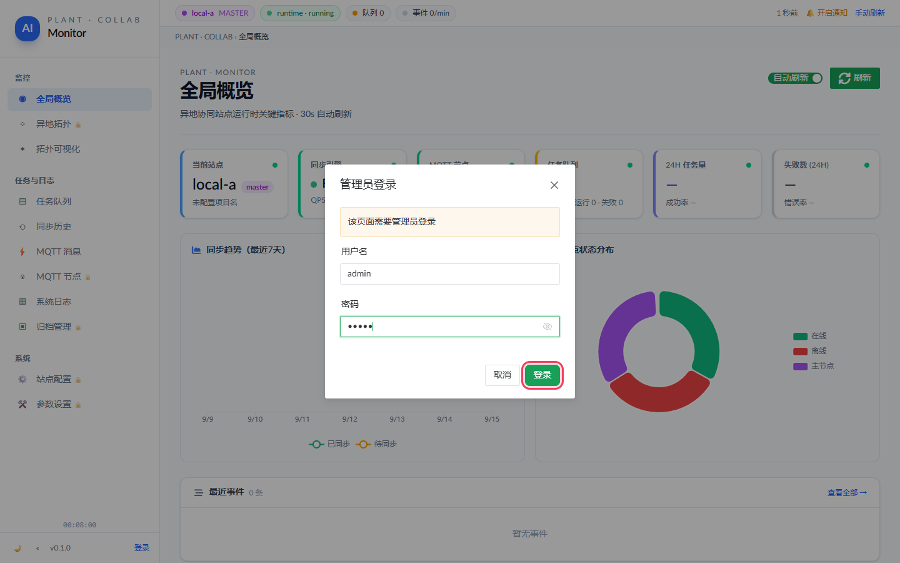

*直接访问 `/topology` 被拦下，填入管理员账号密码后点「登录」。*

> 监控台同时兼容两种后端的登录响应：plant-model-gen 带 `expires_at`，plant-web-server 不带。2026-09-14 之前对后者登录必失败，现已放宽。

> 自动化用例：`DA-01`

## 2. 读懂首屏：运行时 pill 与「已激活」徽标

左边是**环境（Env）**列表，右边是选中环境下的**站点（Site）**。页头右侧的胶囊是**运行时 pill**：它每 30 秒读一次 `GET /api/remote-sync/runtime/status`，告诉你后端此刻用的是哪个环境；鼠标停上去能看到 `env_id`、MQTT 连接状态等细节。

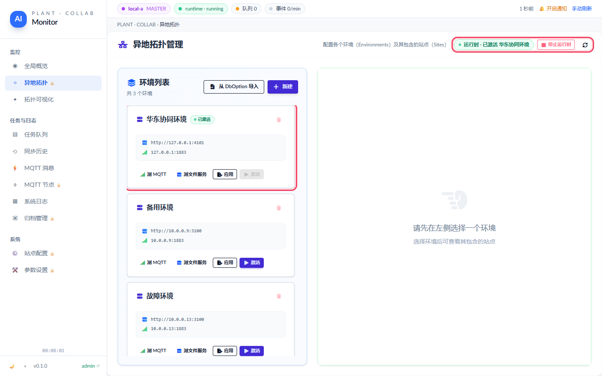

*登录后的首屏。红框：运行时 pill 与当前激活的环境卡片。*

看图要点：

- pill 显示「运行时 · 已激活 华东协同环境」，旁边有「停止运行时」按钮——说明后端 watcher + MQTT 订阅正在跑。
- 被激活的环境卡片右上角挂绿色「已激活」徽标，它自己的「激活」按钮置灰（不能重复激活）。
- 每张卡片下方 4 个动作按钮：**测 MQTT / 测文件服务 / 应用 / 激活**，这就是部署动作面。
- 所有动作做完，监控台都会立刻重拉 `runtime/status` 与环境列表，不用手动刷新。

> 自动化用例：`DA-02` · `DA-14`

## 3. 一键从 DbOption 导入环境

最省事的建环境方式：点环境列表右上角的「从 DbOption 导入」，后端会读**它自己进程**的 `DbOption.toml`（`mqtt_host` / `mqtt_port` / `file_server_host` / `location` / `location_dbs`），反向生成一个环境。这一步**不改写配置、不激活运行时**，只是把当前配置登记成一张卡片，方便接着「激活」或作为模板对照。

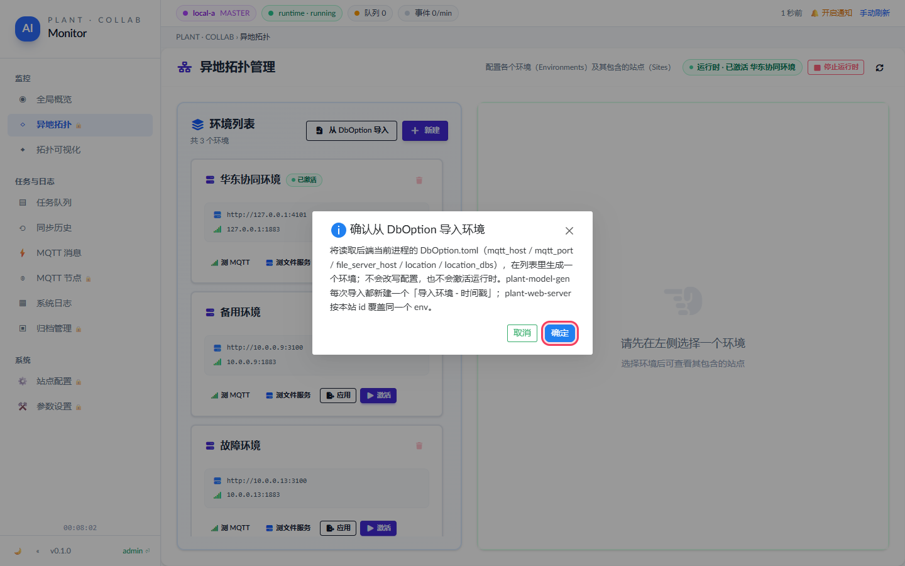

*点「从 DbOption 导入」先弹确认，弹窗写明读什么、不会改什么。点「确定」。*

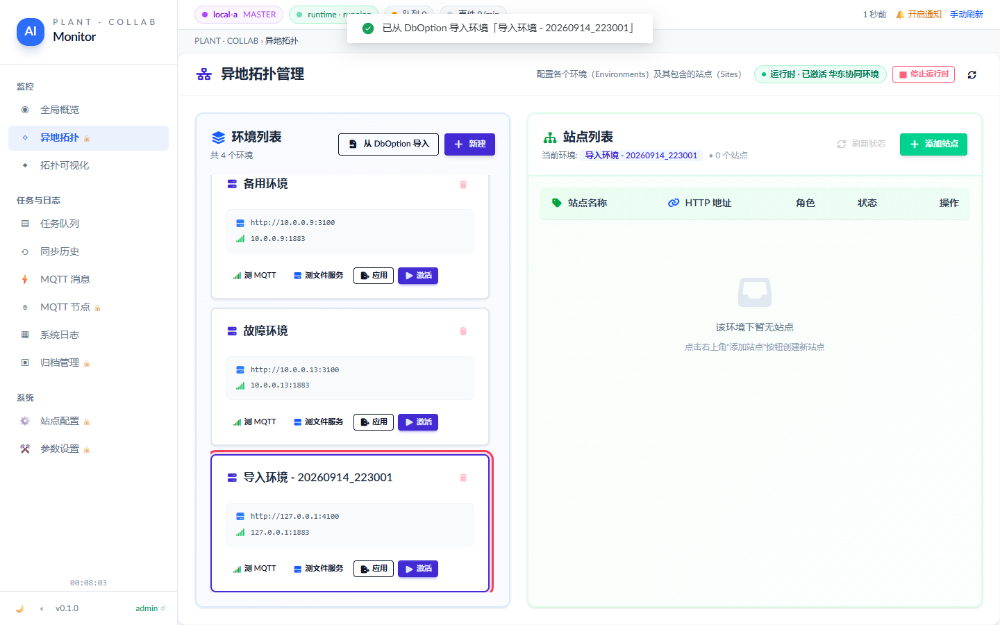

*导入成功：环境计数 +1，新卡片自动被选中（蓝色边框），右侧切到它的站点列表。*

> 两种后端的差别要知道：plant-model-gen **每次导入都新建**一个「导入环境 - 时间戳」（点两次就有两张）；plant-web-server 按本站 id 覆盖同一个 env。所以按钮前面有一道确认弹窗，别手滑连点。

> 自动化用例：`DA-16`

## 4. 手填新建环境

要接一个**别处**的协同环境（比如把上海分部纳入），就点「新建」手填。表单会用本站配置预填 MQTT / 文件服务地址（`localhost` 会被替换成本机出口 IP），你只需改成对方的地址。保存后监控台会**自动把本站加为该环境的第一个站点**。

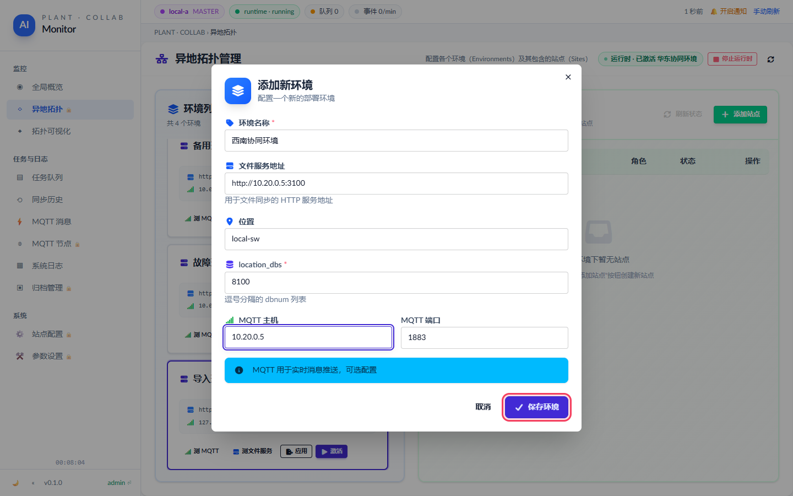

*「新建」表单：改成对端的地址后点「保存环境」。*

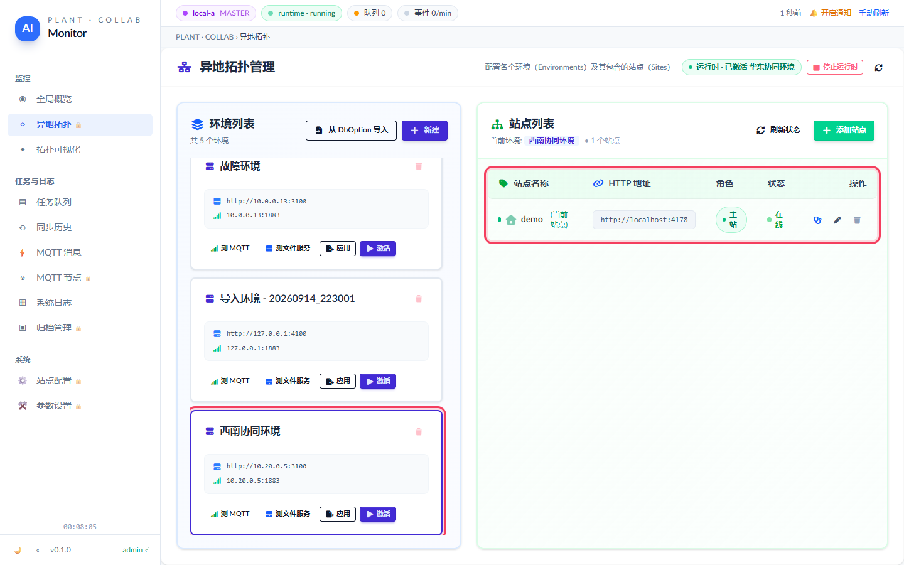

*保存后：新环境被选中，右侧已自动加入本站作为第一个站点。*

字段含义：

| 字段 | 填什么 |
|---|---|
| 环境名称 | 人能看懂的名字，例如「西南协同环境」 |
| 文件服务地址 | 对端站点的文件服务根 URL，`envs/{id}/test-http` 会对它发 GET |
| MQTT 主机 / 端口 | 对端 broker；`test-mqtt` 会 TCP 探这个地址 |
| 位置标识（location） | 对端站点的 `location`，全网唯一，会写进 DbOption |
| 数据库编号（location_dbs） | 逗号分隔，决定同步范围 |

> 真后端上这一步由闭环用例 LF-02 覆盖（真的 `POST envs` + 自动 `POST envs/{id}/sites`）。

> 自动化用例：`LF-02`

## 5. 先测连通，再动运行时

激活之前先在卡片上点两下探测：**测 MQTT** 让后端 TCP 探 `mqtt_host:mqtt_port`，**测文件服务** 让后端对 `file_server_host` 发一次 GET。结果以横条留在卡片里（绿 = 通，红 = 不通），同时右上角弹 toast。探测**由后端发起**，探的是后端到对端的网络，不是你浏览器到对端的。

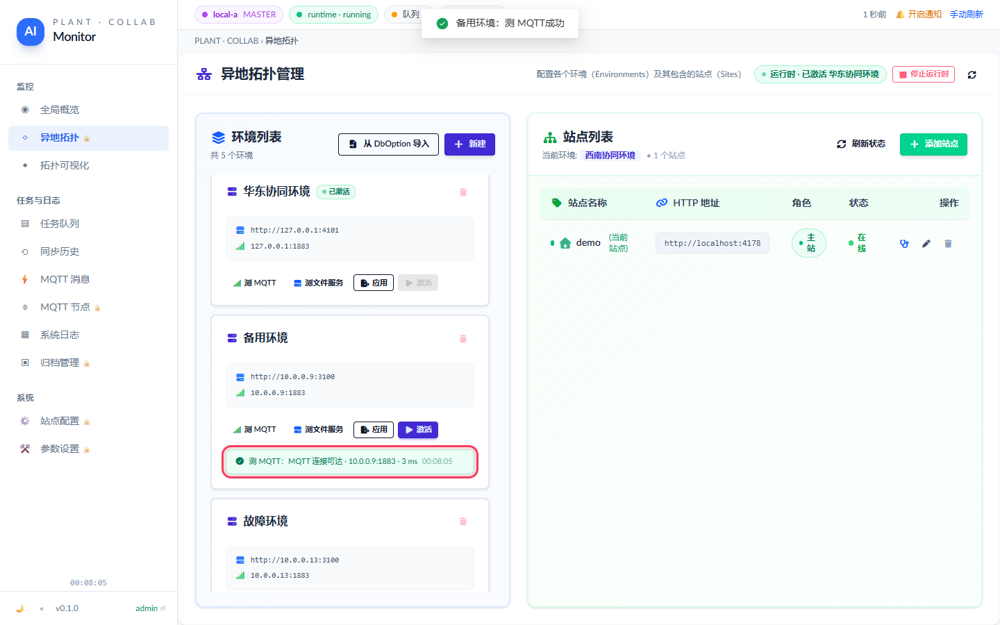

*「测 MQTT」成功：卡片里出现绿色结果条，写着目标地址与耗时。*

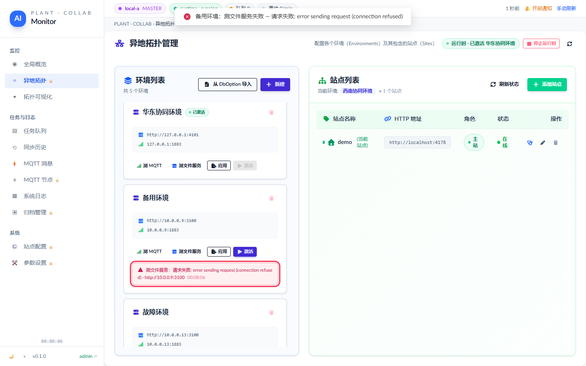

*「测文件服务」失败：红色结果条透出后端原话与目标 URL。*

> 红条里会透出后端原话（`connection refused`、目标 URL、HTTP code、耗时），排网络问题时直接照着看。红条不代表页面出错，只是对端不通。

> 自动化用例：`DA-03` · `DA-04`

## 6. 激活环境（切换运行时）

**激活** = 让后端从此按这个环境跑：plant-model-gen 会把环境写进 `DbOption.toml`，并在进程内重启 watcher + MQTT 订阅，立即生效。这是整页最重的动作，所以有确认弹窗；弹窗会点名当前已激活的环境「会先被停止」。

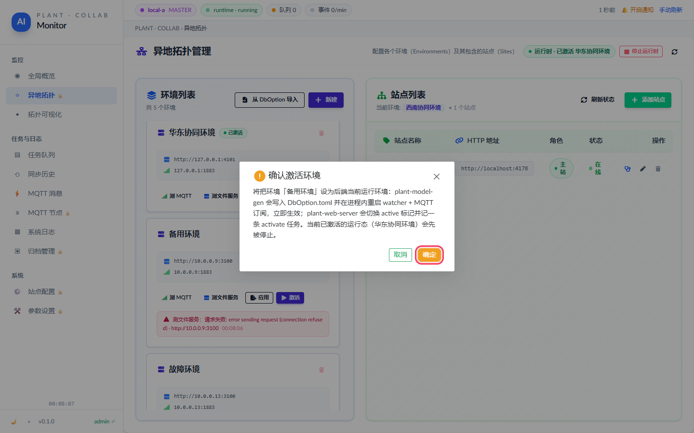

*「激活」前的确认弹窗：写明会改 DbOption.toml、重启 watcher + MQTT，并提示当前环境会先被停止。*

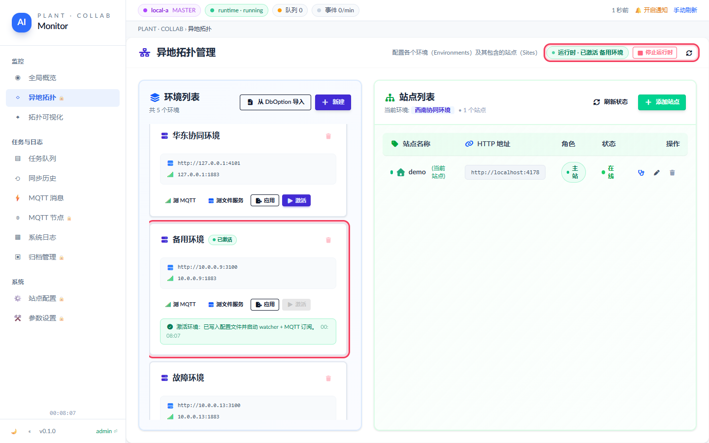

*激活成功：pill、徽标、按钮状态一起切到「备用环境」。*

激活成功后三处同时变化：pill 换成新环境名、「已激活」徽标搬到新卡片、新卡片的「激活」置灰而旧卡片恢复可点。卡片里还会留一条绿色「激活环境：…」结果条。

> 对着真实后端点「激活」会真的改它的配置——联调时先确认 `:3100` 后面是哪台实例（见 HANDOFF「先看清楚后端是谁」）。

> 自动化用例：`DA-05` · `DA-06`

## 7. 应用配置（只写盘，不重启）

**应用** 比激活轻：plant-model-gen 只把环境写进 `DbOption.toml`，**不**重启运行态，等你下次重启或重载配置时生效。适合「先把配置落盘，等维护窗口再切」的场景。同样有确认弹窗。

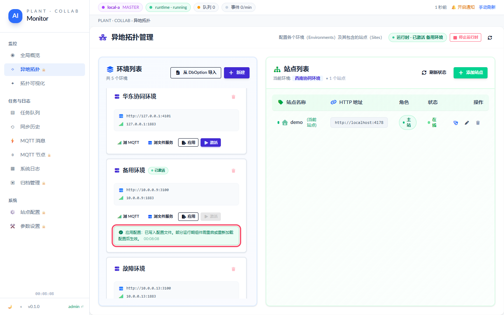

*「应用」成功：绿色结果条提示已写入配置文件、部分组件需重载后生效。*

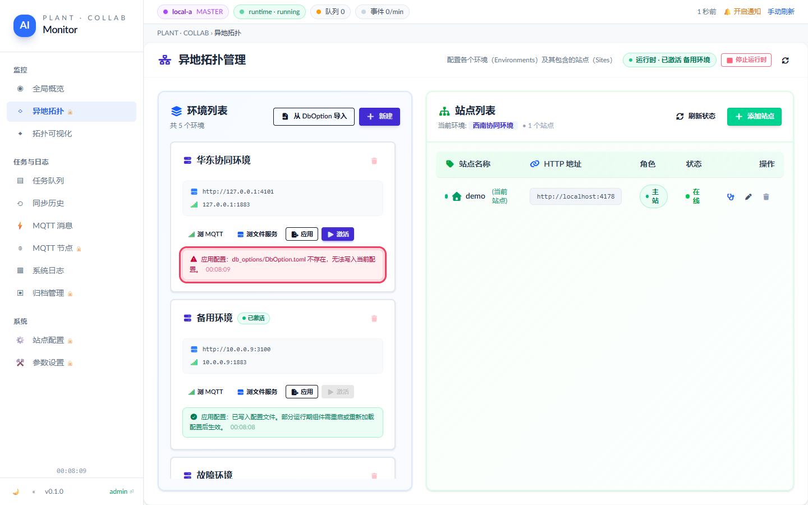

*「应用」业务失败的样子：红色结果条透出后端原因，运行时 pill 不变。*

> 后端 HTTP 200 但业务失败（例如 `DbOption.toml 不存在`）时，卡片里是红色「应用配置：…」条并透出原因，pill 不变——监控台按响应里的 `status` / `success` 判断成败，不是按 HTTP 状态码。

> 自动化用例：`DA-07` · `DA-08`

## 8. 站点：后端探测与编辑

点卡片标题选中环境，右侧就是它的站点表。每行有两种「在线」判断：**状态列**是你的浏览器直连对端 `/api/health` 的结果（受 CORS / 内网限制），**听诊器按钮**是让后端去探 `sites/{id}/test-http`——两者不一致时以后端探测为准。「编辑」复用添加站点弹窗，保存走 `PUT /api/remote-sync/sites/{id}`。

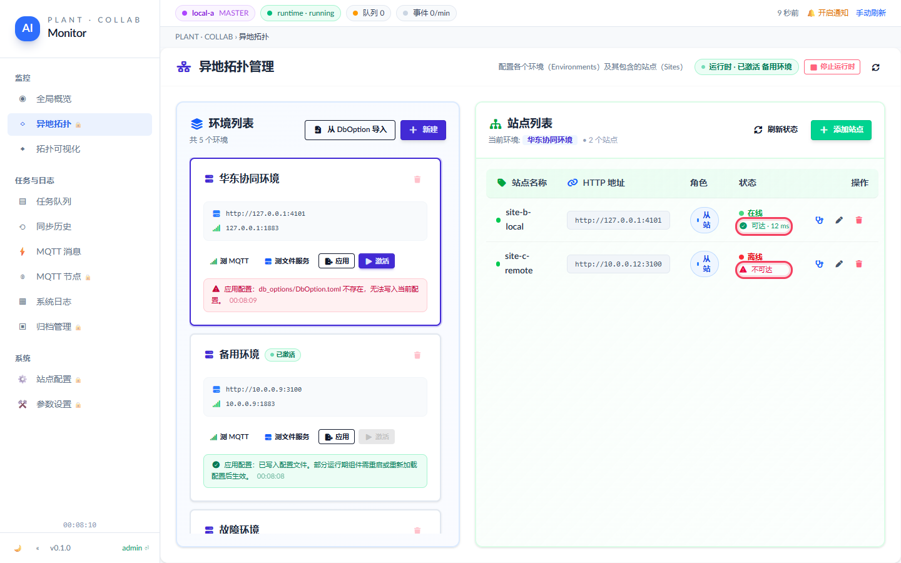

*选中「华东协同环境」后的站点表：两行都点过听诊器，一绿一红。*

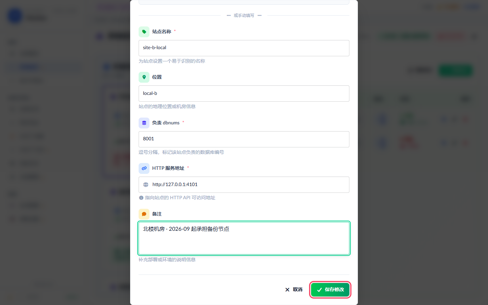

*「编辑站点」：字段预填，改完点「保存修改」（走 PUT sites/{id}）。*

> 探测结果写在行内（「可达 · 12 ms」/「不可达」），完整原因放在鼠标悬停的 title 里。

> 自动化用例：`DA-09` · `DA-10` · `DA-11` · `DA-15`

## 9. 停止运行时

维护、换 broker、或者要彻底停掉跨站点同步时，点页头的「停止运行时」。plant-model-gen 会终止 watcher + MQTT 订阅并清掉激活态；确认弹窗会点名当前环境。

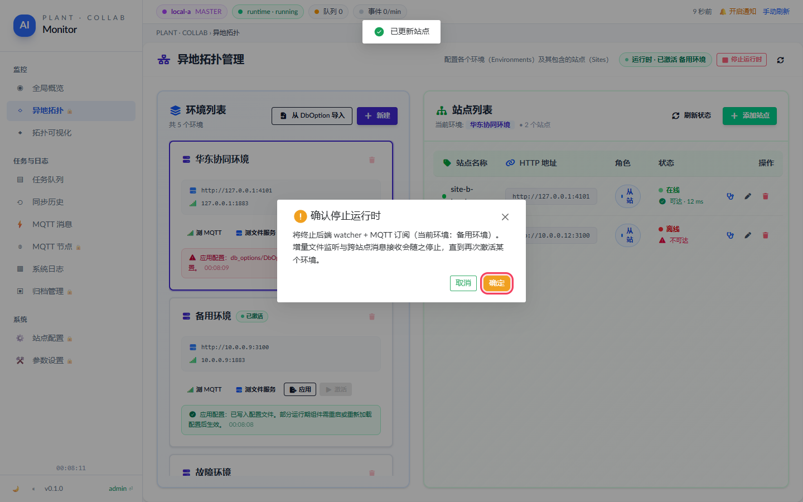

*「停止运行时」的确认弹窗，点名当前环境。*

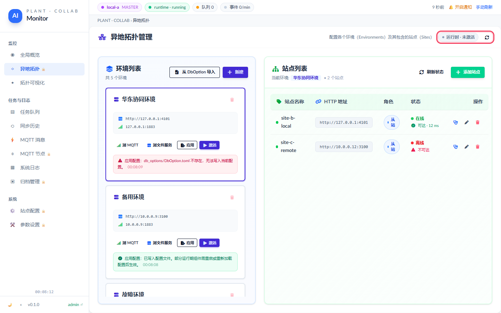

*停止后的页头：pill 变为「未激活」，停止按钮消失。*

停止后 pill 变成「运行时 · 未激活」，「停止运行时」按钮消失，所有卡片的「激活」恢复可点、徽标消失——再点任意一张卡片的「激活」即可恢复。

> 自动化用例：`DA-12`

## 10. 出错时你会看到什么

后端 5xx、网络断开、token 过期，监控台都不会白屏或弹浏览器原生 alert：动作类失败落成红色结果条「…：请求失败 — <原因>」+ 一条错误 toast；401/403 会自动弹回登录框。

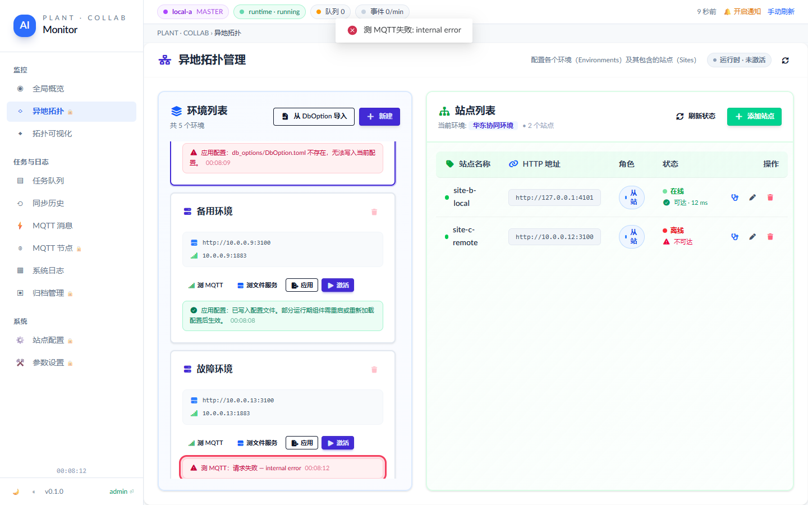

*后端返回 500 时：红色「请求失败 — internal error」结果条，页面照常可用。*

排查顺序：

1. 红条里的原因是后端原话，先照它查（`connection refused` = 对端没起 / 防火墙；`DbOption.toml 不存在` = 后端工作目录不对）。
2. 左下角状态条若显示后端离线，先看 `:3100` 上跑的是不是你要的实例。
3. 再看后端日志；监控台不吞错，浏览器控制台里也有同样的 `console.error`。

> 自动化用例：`DA-13`

## 附录 A. 同一套按钮在 plant-web-server 上的差别

本机 `:3100` 现在跑的是 `../plant-web-server`（standalone-real），不是 plant-model-gen 的 `web_server`。路由相同、语义更轻，监控台两边都兼容，但你看到的现象不同：

| 动作 | plant-model-gen | plant-web-server |
|---|---|---|
| 激活 | 写 `DbOption.toml` + 重启 watcher / MQTT | 把 `mqtt_host / mqtt_port / file_server_host / location / location_dbs` 写进本站 `DbOption.toml` + 起 / 重建中继运行态（2026-09-16 起；之前只切 `envs[].active` 标记） |
| 应用 | 只写 `DbOption.toml` | 只落账：标为当前环境 + 一条 apply 任务，不写文件、不动运行态 |
| 测 MQTT / 测文件服务 / 站点探测 | 真探 `mqtt_host:port` / GET `file_server_host` | 2026-09-18 起也真探：TCP `mqtt_host:mqtt_port`、GET `file_server_host`、站点 GET `<http_host>/metadata.json`，响应带 `message / url / code / latency_ms`（之前只 TCP 探 env 的 `host/port` 字段，监控台建的 env 一律「目标不可达 · 127.0.0.1」） |
| 停止运行时 | 清激活态，pill →「未激活」 | 停中继：`active` → false，pill →「运行中 · 未激活环境」；`running` 恒 true，账面 `envs[].active` 不清 |
| 删除环境 | 级联删站点 | 不级联（sites.json 留孤儿） |
| 从 DbOption 导入 | 每次新建（带连接参数） | 覆盖同一个 `dboption-<site_id>`，只带工程 / 端口 / 配置文件路径，**不带**连接参数 |

这些差异已记在 `AGENTS.md` §4.3.2，等后端修正后监控台的判定不用改（统一走 `isRemoteSyncActionOk()`）。


*plant-web-server 下首屏与 plant-model-gen 一样，只是 pill 的悬停详情换成 `mode: standalone-real · 活动任务: N`。*

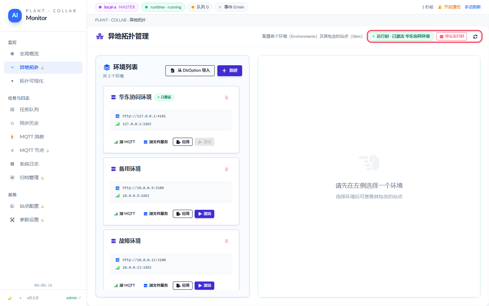

*同样点了「停止运行时」并成功，但 plant-web-server 不清 `active`，pill 照旧——这是后端语义，不是监控台没刷新。*

> 自动化用例：`DA-02` · `DA-12`（pws 形状）

## 附录 B. 步骤 ↔ 自动化用例对照

| 教程步骤 | 用例 | 验证点 |
|---|---|---|
| 1. 登录并进入「异地拓扑」 | `DA-01` | 登录并重定向回 /topology（两种 login 形状） |
| 2. 读懂首屏：运行时 pill 与「已激活」徽标 | `DA-02` | 运行时 pill 初始态、已激活徽标、激活按钮禁用 |
| 2. 读懂首屏：运行时 pill 与「已激活」徽标 | `DA-14` | 动作后重拉 runtime/status 与 env 列表 |
| 3. 一键从 DbOption 导入环境 | `DA-16` | 从 DbOption 导入：取消 0 写、确定 1 次、新卡选中 |
| 4. 手填新建环境 | `LF-02` | （真后端闭环）新建 env + 自动加入本站 |
| 5. 先测连通，再动运行时 | `DA-03` | 测 MQTT 成功 → 绿色结果条含目标地址 |
| 5. 先测连通，再动运行时 | `DA-04` | 测文件服务失败 → 红色结果条含原因 |
| 6. 激活环境（切换运行时） | `DA-05` | 激活 → 确认弹窗文案 → 取消 = 0 写请求 |
| 6. 激活环境（切换运行时） | `DA-06` | 激活 → 确定 → pill / 徽标 / 按钮随之切换 |
| 7. 应用配置（只写盘，不重启） | `DA-07` | 应用成功 → 绿色结果条 |
| 7. 应用配置（只写盘，不重启） | `DA-08` | 应用业务失败（HTTP 200）→ 红色结果条，运行态不变 |
| 8. 站点：后端探测与编辑 | `DA-09` | 站点 test-http 可达 |
| 8. 站点：后端探测与编辑 | `DA-10` | 站点 test-http 不可达 + title 含原因 |
| 8. 站点：后端探测与编辑 | `DA-11` | 编辑站点 → PUT sites/{id} 落到后端 |
| 8. 站点：后端探测与编辑 | `DA-15` | 站点表 1440 宽度无横向溢出 |
| 9. 停止运行时 | `DA-12` | 停止运行时 → pill 跟随后端语义 |
| 10. 出错时你会看到什么 | `DA-13` | 后端 5xx → 「请求失败」结果条，无未捕获错误 |

## 附录 C. 重新生成本教程

改了 `/topology` 的文案或布局，先跑用例再重出图，两者用的是同一份 mock：

```powershell
npm run smoke:topology-deploy -- --build      # DA-01–16 × pmg/pws，先保证全过
npm run tutorial:topology-deploy              # 重出 docs/tutorials/screenshots/topology-deploy/*.png + 本文
node scripts/generate-remote-collab-docx.mjs docs/tutorials/topology-deploy-tutorial.md   # 需要 Word 版时（docx 不入库）
```

截图是 mock 数据（环境名、地址都是演示值）；真实联调请按 `HANDOFF.md`「先看清楚后端是谁」确认 `:3100` 后面的实例，再对着它操作。
